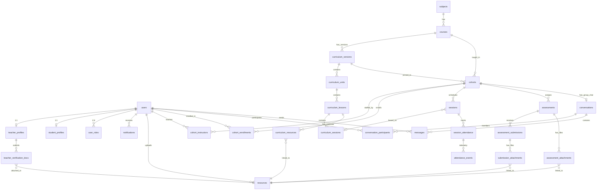
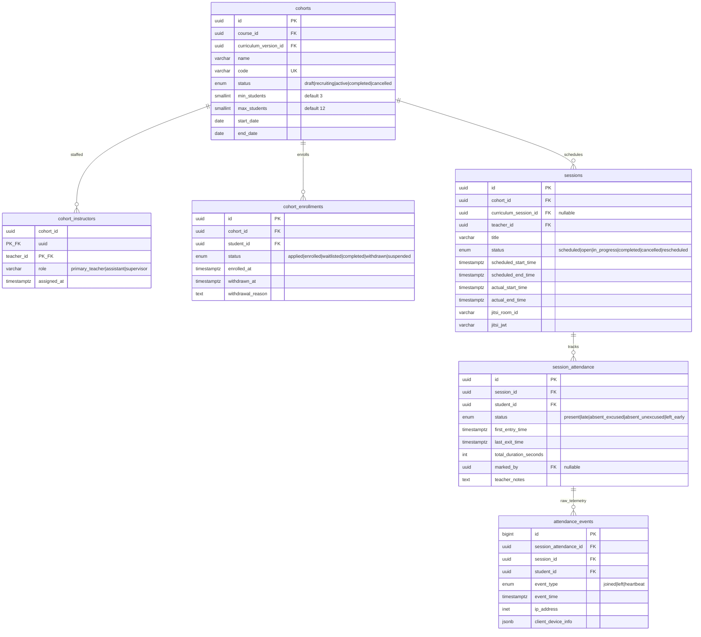
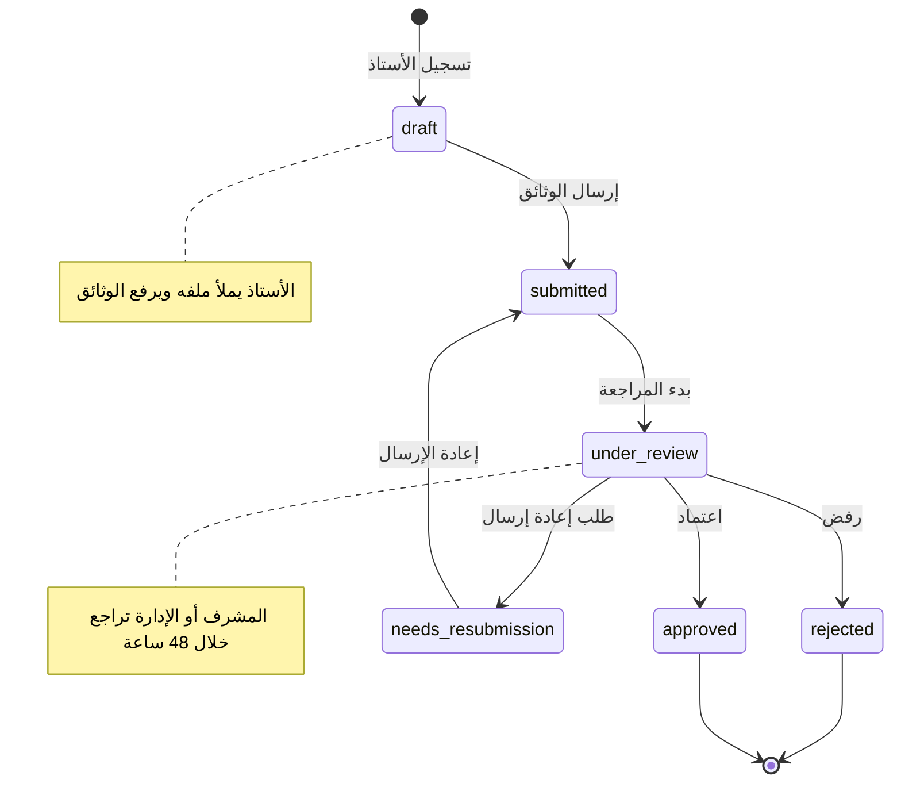
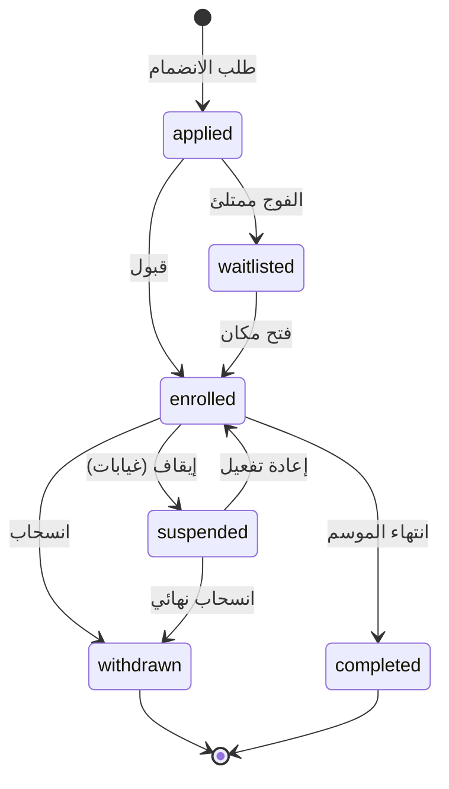
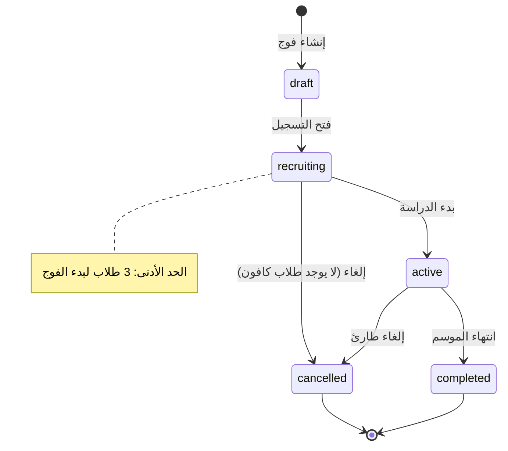
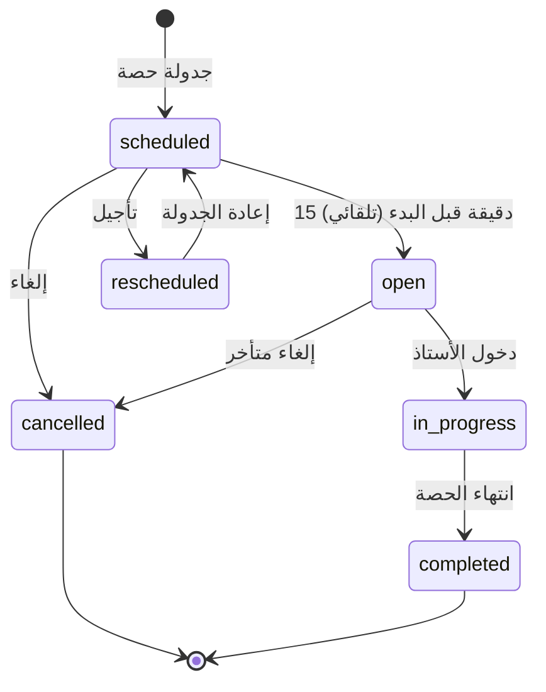
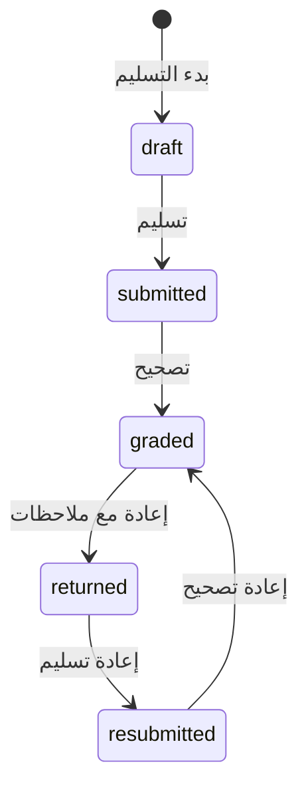
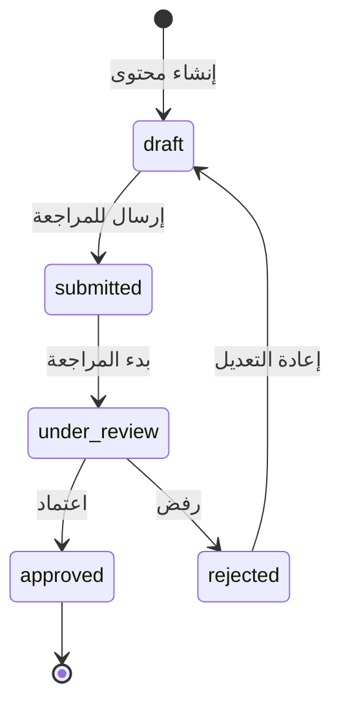
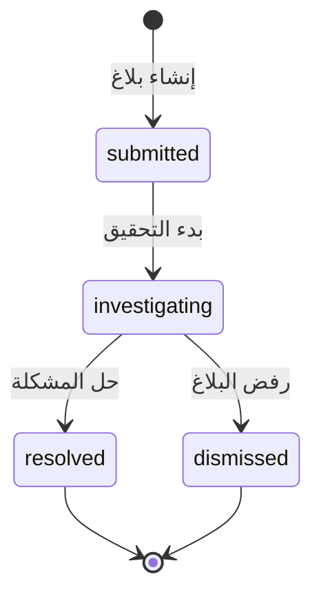
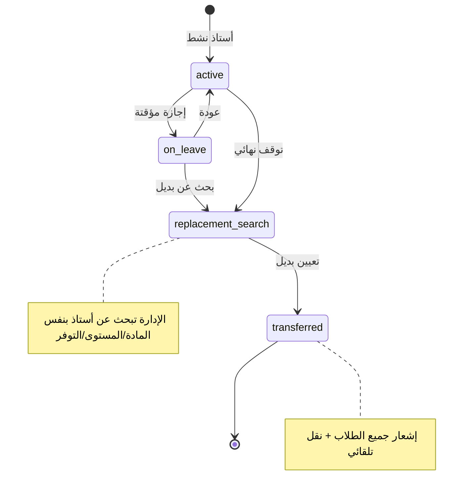

# وثيقة الهندسة المعمارية الرئيسية — منصة باقون
# Master Technical Architecture — Baaqoon Platform

> **العقد الهندسي**: هذه الوثيقة هي المرجع الأعلى لأي وكيل برمجي أو مطور يعمل على منصة باقون.
> أي كود يُكتب يجب أن يتوافق مع ما هو محدد هنا. أي انحراف يتطلب تحديث هذه الوثيقة أولاً.

**التاريخ:** 18 سبتمبر 2026
**الحالة:** مسودة معمارية — جاهزة للمراجعة
**النسخة:** 1.0.0

---

## جدول المحتويات

1. [المبادئ المعمارية](#1-المبادئ-المعمارية)
2. [المكدس التقني](#2-المكدس-التقني)
3. [نموذج المجال و ERD](#3-نموذج-المجال)
4. [مخطط قاعدة البيانات](#4-مخطط-قاعدة-البيانات)
5. [نظام الصلاحيات RBAC](#5-نظام-الصلاحيات)
6. [آلات الحالة State Machines](#6-آلات-الحالة)
7. [عقود API](#7-عقود-api)
8. [هيكلة المشروع](#8-هيكلة-المشروع)
9. [نموذج الأمان](#9-نموذج-الأمان)
10. [التخزين والملفات](#10-التخزين-والملفات)
11. [البث المباشر والـ WebSocket](#11-البث-المباشر)
12. [نظام التدقيق Audit](#12-نظام-التدقيق)
13. [نظام الإشعارات](#13-نظام-الإشعارات)
14. [نظام المحادثات والإشراف](#14-نظام-المحادثات)
15. [الفصل الافتراضي Jitsi](#15-الفصل-الافتراضي)
16. [الأداء والعمل دون اتصال](#16-الأداء)
17. [خطة التنفيذ](#17-خطة-التنفيذ)
18. [خطة التحقق](#18-خطة-التحقق)

---

## 1. المبادئ المعمارية

### 1.1 القرارات المعمارية الأساسية

| القرار | الاختيار | السبب |
|--------|---------|-------|
| النمط المعماري | **Modular Monolith** | أسرع في البناء، أقل تعقيداً، قابل للتفكيك لاحقاً |
| حدود الوحدات | **Facade Pattern + Domain Events** | عزل كامل بين الوحدات مع تواصل صريح |
| قاعدة البيانات | **PostgreSQL واحدة، Multi-Schema** | نضج، سلامة مرجعية، أداء ممتاز |
| ORM | **Prisma** | Type-safety مع TypeScript، هجرات قوية |
| الحالة | **XState v5 + DB Rehydration** | منع الحالات المتناقضة، تحولات حتمية |
| المصادقة | **JWT + Passport** | معيار صناعي، Stateless |
| التفويض | **CASL (RBAC + ABAC)** | صلاحيات مرنة على مستوى السجل |
| البث المباشر | **Jitsi Meet (Self-hosted)** | مفتوح المصدر، لا تسجيل، خصوصية كاملة |
| التخزين | **S3-Compatible Object Storage** | فصل الملفات عن قاعدة البيانات |

### 1.2 المبادئ غير القابلة للتفاوض

1. **الصلاحيات تُفرض من Backend وليس من الواجهة فقط** — إخفاء زر ≠ حماية
2. **كل عملية حساسة تمر عبر State Machine** — لا تحول مباشر للحالة في DB
3. **المنهاج Versioned وImmutable بعد النشر** — لا تعديل يمس الأفواج النشطة
4. **الحضور يُسجل كتيليمتري كامل** — وقت دخول، خروج، مدة، وليس فقط حاضر/غائب
5. **الملفات: Metadata في DB + Binary في Object Storage** — مع Signed URLs
6. **Audit Log لكل عملية حساسة** — Append-only، غير قابل للتعديل
7. **لا Microservices في المرحلة الأولى** — Modular Monolith أولاً
8. **لا اعتماد على حظر الكلمات فقط للمحادثات** — نظام Safe → Flagged → Blocked → Manual Review
9. **منع التسجيل تقنياً في Jitsi مع إقرار سياسي** — لا ضمان مطلق لتسجيل الشاشة الخارجي
10. **Offline Mode محدود ومحدد** — قراءة مخزنة فقط، لا بث مباشر

---

## 2. المكدس التقني

```yaml
Frontend:
  Framework: React 18+ with TypeScript
  Build: Vite 5+
  Styling: Tailwind CSS 3+
  State: TanStack Query (Server State) + Zustand (Client State)
  Forms: React Hook Form + Zod (Validation)
  Router: React Router v6+ (or TanStack Router)
  i18n: react-i18next (Arabic RTL + English)
  Charts: Recharts (for analytics)
  Icons: Lucide React
  Testing: Vitest + React Testing Library + Playwright (E2E)

Backend:
  Runtime: Node.js 20 LTS
  Framework: NestJS 10+ with TypeScript
  API Style: REST (JSON) — GraphQL deferred to Phase 2
  ORM: Prisma 5+
  Validation: class-validator + class-transformer
  Auth: @nestjs/passport + passport-jwt
  AuthZ: @casl/ability (RBAC + ABAC)
  State Machines: XState v5
  Events: @nestjs/event-emitter
  WebSocket: @nestjs/websockets + Socket.IO
  File Upload: Multer + S3 SDK
  Email: Nodemailer + MJML templates
  Logging: Pino (structured JSON)
  Testing: Jest + Supertest + Testcontainers

Database:
  Primary: PostgreSQL 16+
  Cache: Redis 7+ (sessions, rate-limiting, WebSocket scaling)
  Search: PostgreSQL Full-Text Search (defer Elasticsearch)

Storage:
  Provider: S3-Compatible (MinIO self-hosted or AWS S3)
  CDN: Optional — Cloudflare R2 for static assets

Live Classroom:
  Provider: Jitsi Meet (Self-hosted Docker)
  Integration: IFrame API + JWT tokens
  Whiteboard: Excalidraw (embedded)

DevOps:
  Containerization: Docker + Docker Compose
  CI/CD: GitHub Actions
  Reverse Proxy: Nginx / Caddy
  Monitoring: Prometheus + Grafana (deferred)
  Hosting: VPS (Hetzner / DigitalOcean) — defer Kubernetes
```

---

## 3. نموذج المجال

### 3.1 الكيانات الأساسية (Domain Entities)

| الكيان (Entity) | الوصف | الوحدة (Module) |
|-----------------|-------|----------------|
| `User` | المستخدم الأساسي بكل الأدوار | `auth` |
| `TeacherProfile` | ملف الأستاذ المتطوع + التحقق | `teachers` |
| `StudentProfile` | ملف الطالب + ولي الأمر | `students` |
| `Subject` | المادة الدراسية (رياضيات، عربي...) | `curriculum` |
| `CurriculumVersion` | نسخة المنهاج (فلسطيني 2026/2027) | `curriculum` |
| `CurriculumUnit` | الوحدة (الجبر، الهندسة...) | `curriculum` |
| `CurriculumLesson` | الدرس (المعادلات من الدرجة الأولى) | `curriculum` |
| `CurriculumSession` | قالب الحصة داخل الدرس | `curriculum` |
| `Cohort` | الفوج (3-12 طالب) | `groups` |
| `CohortEnrollment` | تسجيل الطالب في الفوج | `groups` |
| `CohortInstructor` | تعيين الأستاذ للفوج | `groups` |
| `Session` | الحصة المجدولة الفعلية | `scheduling` |
| `SessionAttendance` | سجل حضور مجمع لكل طالب/حصة | `attendance` |
| `AttendanceEvent` | تيليمتري الحضور (دخول/خروج/heartbeat) | `attendance` |
| `Assessment` | واجب أو اختبار | `assessments` |
| `AssessmentSubmission` | تسليم الطالب | `assessments` |
| `Resource` | ملف مرفوع (metadata فقط) | `resources` |
| `Conversation` | محادثة (جماعية أو خاصة) | `chat` |
| `Message` | رسالة داخل محادثة | `chat` |
| `Notification` | إشعار للمستخدم | `notifications` |
| `AuditLog` | سجل التدقيق | `audit` |
| `Report` | بلاغ عن محتوى أو سلوك | `moderation` |

### 3.2 مخطط العلاقات ERD



### 3.3 مخطط العلاقات التفصيلي — الفوج والحصة



---

## 4. مخطط قاعدة البيانات

### 4.1 الأنواع المعددة (Enums)

```sql
-- أدوار المستخدمين
CREATE TYPE user_role AS ENUM (
    'super_admin',        -- المشرف العام
    'subject_supervisor', -- مشرف المادة
    'tech_support',       -- الدعم التقني
    'teacher',            -- أستاذ متطوع
    'student'             -- طالب
);

-- حالة حساب المستخدم
CREATE TYPE user_status AS ENUM ('pending', 'active', 'suspended', 'deactivated');

-- حالة التحقق من الأستاذ
CREATE TYPE teacher_verification_status AS ENUM (
    'draft',              -- لم يُرسل بعد
    'submitted',          -- تم الإرسال للمراجعة
    'under_review',       -- قيد المراجعة
    'approved',           -- مقبول
    'rejected',           -- مرفوض
    'needs_resubmission'  -- يحتاج إعادة إرسال
);

-- نوع وثيقة التحقق
CREATE TYPE verification_doc_type AS ENUM (
    'degree_certificate', -- شهادة جامعية
    'teaching_license',   -- رخصة تدريس
    'identity_document',  -- وثيقة هوية
    'resume'              -- السيرة الذاتية
);

-- حالة وثيقة التحقق
CREATE TYPE verification_doc_status AS ENUM ('pending', 'verified', 'rejected');

-- نوع المنهاج
CREATE TYPE curriculum_type AS ENUM (
    'palestinian',  -- فلسطيني
    'azhari'        -- أزهري
);

-- الفرع الدراسي
CREATE TYPE academic_branch AS ENUM (
    'scientific',   -- علمي
    'literary',     -- أدبي
    'commercial',   -- تجاري
    'industrial',   -- صناعي
    'sharia'        -- شرعي
);

-- المستوى الدراسي
CREATE TYPE grade_level AS ENUM (
    'grade_11',     -- الحادي عشر (أولى ثانوي)
    'grade_12'      -- الثاني عشر (التوجيهي)
);

-- حالة نسخة المنهاج
CREATE TYPE curriculum_status AS ENUM ('draft', 'in_review', 'published', 'archived');

-- حالة التسجيل في الفوج
CREATE TYPE enrollment_status AS ENUM (
    'applied',      -- تقدم بطلب
    'enrolled',     -- مسجل
    'waitlisted',   -- في قائمة الانتظار
    'completed',    -- أكمل
    'withdrawn',    -- انسحب
    'suspended'     -- موقوف
);

-- حالة الفوج
CREATE TYPE cohort_status AS ENUM (
    'draft',        -- مسودة
    'recruiting',   -- يستقبل طلاب
    'active',       -- نشط
    'completed',    -- مكتمل
    'cancelled'     -- ملغى
);

-- حالة الحصة
CREATE TYPE session_status AS ENUM (
    'scheduled',    -- مجدولة
    'open',         -- مفتوحة (15 دقيقة قبل البدء)
    'in_progress',  -- جارية
    'completed',    -- مكتملة
    'cancelled',    -- ملغاة
    'rescheduled'   -- مؤجلة
);

-- حالة الحضور
CREATE TYPE attendance_status AS ENUM (
    'present',           -- حاضر
    'late',              -- متأخر
    'absent_excused',    -- غائب بعذر
    'absent_unexcused',  -- غائب بدون عذر
    'left_early'         -- غادر مبكراً
);

-- نوع حدث الحضور (تيليمتري)
CREATE TYPE attendance_event_type AS ENUM ('joined', 'left', 'heartbeat');

-- نوع التقييم
CREATE TYPE assessment_type AS ENUM (
    'assignment',   -- واجب
    'quiz',         -- اختبار قصير
    'exam'          -- اختبار
);

-- حالة التسليم
CREATE TYPE submission_status AS ENUM (
    'draft',        -- مسودة
    'submitted',    -- مُسلَّم
    'graded',       -- مُصحَّح
    'returned',     -- مُعاد
    'resubmitted'   -- أعيد تسليمه
);

-- مزود التخزين
CREATE TYPE storage_provider AS ENUM ('s3', 'minio', 'r2', 'local');

-- نوع المحادثة
CREATE TYPE conversation_type AS ENUM (
    'cohort_group', -- محادثة الفوج الجماعية
    'direct',       -- محادثة خاصة (طالب-أستاذ)
    'announcement'  -- إعلانات (اتجاه واحد)
);

-- نوع الرسالة
CREATE TYPE message_type AS ENUM ('text', 'file', 'system');

-- حالة مراجعة المحتوى
CREATE TYPE content_moderation_status AS ENUM (
    'safe',         -- آمن
    'flagged',      -- مشتبه
    'blocked',      -- محظور
    'manual_review' -- بحاجة مراجعة يدوية
);

-- نوع الإشعار
CREATE TYPE notification_type AS ENUM (
    'session_reminder',      -- تذكير بالحصة
    'session_cancelled',     -- إلغاء حصة
    'assignment_due',        -- موعد الواجب
    'grade_published',       -- نشر الدرجة
    'attendance_alert',      -- تنبيه حضور
    'enrollment_update',     -- تحديث التسجيل
    'verification_update',   -- تحديث التحقق
    'transfer_notice',       -- إشعار نقل
    'system_alert',          -- تنبيه نظام
    'chat_message'           -- رسالة جديدة
);

-- نوع البلاغ
CREATE TYPE report_type AS ENUM (
    'inappropriate_content', -- محتوى غير لائق
    'harassment',            -- تحرش
    'off_topic',             -- خارج الموضوع
    'policy_violation',      -- مخالفة سياسات
    'other'                  -- أخرى
);

-- حالة البلاغ
CREATE TYPE report_status AS ENUM (
    'submitted',     -- مُقدَّم
    'investigating', -- قيد التحقيق
    'resolved',      -- تم الحل
    'dismissed'      -- مرفوض
);
```

### 4.2 جداول المستخدمين والملفات الشخصية

```sql
CREATE EXTENSION IF NOT EXISTS "uuid-ossp";
CREATE EXTENSION IF NOT EXISTS "btree_gist";

-- ═══════════════════════════════════════════════════════
-- المستخدمون
-- ═══════════════════════════════════════════════════════

CREATE TABLE users (
    id              UUID PRIMARY KEY DEFAULT gen_random_uuid(),
    email           VARCHAR(255) NOT NULL,
    phone           VARCHAR(32),
    password_hash   VARCHAR(255) NOT NULL,
    first_name      VARCHAR(100) NOT NULL,
    last_name       VARCHAR(100) NOT NULL,
    avatar_url      VARCHAR(1024),
    primary_role    user_role NOT NULL,
    status          user_status NOT NULL DEFAULT 'pending',
    email_verified  BOOLEAN NOT NULL DEFAULT FALSE,
    timezone        VARCHAR(64) NOT NULL DEFAULT 'Asia/Gaza',
    locale          VARCHAR(10) NOT NULL DEFAULT 'ar',
    last_login_at   TIMESTAMPTZ,
    created_at      TIMESTAMPTZ NOT NULL DEFAULT clock_timestamp(),
    updated_at      TIMESTAMPTZ NOT NULL DEFAULT clock_timestamp(),
    deleted_at      TIMESTAMPTZ NULL,

    CONSTRAINT uq_users_email UNIQUE (email),
    CONSTRAINT chk_users_email_format
        CHECK (email ~* '^[A-Za-z0-9._%+-]+@[A-Za-z0-9.-]+\.[A-Za-z]{2,}$')
);

-- دعم تعدد الأدوار (مشرف مادة يمكن أن يكون أستاذاً أيضاً)
CREATE TABLE user_roles (
    user_id     UUID NOT NULL REFERENCES users(id) ON DELETE CASCADE,
    role        user_role NOT NULL,
    granted_at  TIMESTAMPTZ NOT NULL DEFAULT clock_timestamp(),
    granted_by  UUID REFERENCES users(id) ON DELETE SET NULL,
    PRIMARY KEY (user_id, role)
);

-- ═══════════════════════════════════════════════════════
-- ملف الأستاذ المتطوع
-- ═══════════════════════════════════════════════════════

CREATE TABLE teacher_profiles (
    user_id                 UUID PRIMARY KEY REFERENCES users(id) ON DELETE CASCADE,
    verification_status     teacher_verification_status NOT NULL DEFAULT 'draft',
    headline                VARCHAR(255),
    bio                     TEXT,
    years_of_experience     NUMERIC(3, 1) DEFAULT 0.0
                            CHECK (years_of_experience >= 0),
    max_students_per_cohort SMALLINT DEFAULT 12
                            CHECK (max_students_per_cohort BETWEEN 1 AND 15),
    qualifications          JSONB DEFAULT '[]'::jsonb,
    -- الجدول الأسبوعي للتوفر (JSON array of {day, start_time, end_time})
    weekly_availability     JSONB DEFAULT '[]'::jsonb,
    -- المواد التي يدرسها
    teaching_subjects       UUID[] DEFAULT ARRAY[]::UUID[],
    -- المنهاج
    curriculum_type         curriculum_type,
    -- الفروع التي يدرسها
    academic_branches       academic_branch[] DEFAULT ARRAY[]::academic_branch[],
    -- المستويات
    grade_levels            grade_level[] DEFAULT ARRAY[]::grade_level[],
    -- التوقيع الإلكتروني (موافقة على الشروط)
    terms_accepted          BOOLEAN NOT NULL DEFAULT FALSE,
    terms_accepted_at       TIMESTAMPTZ,
    -- مراجعة
    submitted_at            TIMESTAMPTZ,
    reviewed_at             TIMESTAMPTZ,
    reviewed_by             UUID REFERENCES users(id) ON DELETE SET NULL,
    rejection_reason        TEXT,
    -- إيقاف
    is_on_leave             BOOLEAN NOT NULL DEFAULT FALSE,
    leave_started_at        TIMESTAMPTZ,
    leave_reason            TEXT,

    created_at              TIMESTAMPTZ NOT NULL DEFAULT clock_timestamp(),
    updated_at              TIMESTAMPTZ NOT NULL DEFAULT clock_timestamp()
);

-- ═══════════════════════════════════════════════════════
-- ملف الطالب
-- ═══════════════════════════════════════════════════════

CREATE TABLE student_profiles (
    user_id             UUID PRIMARY KEY REFERENCES users(id) ON DELETE CASCADE,
    -- البيانات الأكاديمية
    curriculum_type     curriculum_type NOT NULL DEFAULT 'palestinian',
    academic_branch     academic_branch NOT NULL,
    grade_level         grade_level NOT NULL,
    -- بيانات ولي الأمر
    guardian_name       VARCHAR(150),
    guardian_phone      VARCHAR(32),
    guardian_email      VARCHAR(255),
    -- التحقق من الطالب
    student_id_card_url VARCHAR(1024),
    school_code         VARCHAR(64),
    is_verified         BOOLEAN NOT NULL DEFAULT FALSE,
    verified_at         TIMESTAMPTZ,
    verified_by         UUID REFERENCES users(id) ON DELETE SET NULL,
    -- التفضيلات
    preferred_times     JSONB DEFAULT '[]'::jsonb,
    subjects_needed     UUID[] DEFAULT ARRAY[]::UUID[],

    created_at          TIMESTAMPTZ NOT NULL DEFAULT clock_timestamp(),
    updated_at          TIMESTAMPTZ NOT NULL DEFAULT clock_timestamp()
);
```

### 4.3 الموارد والملفات

```sql
-- ═══════════════════════════════════════════════════════
-- الموارد (metadata فقط — الملفات في Object Storage)
-- ═══════════════════════════════════════════════════════

CREATE TABLE resources (
    id                  UUID PRIMARY KEY DEFAULT gen_random_uuid(),
    uploader_id         UUID NOT NULL REFERENCES users(id) ON DELETE RESTRICT,
    storage_provider    storage_provider NOT NULL DEFAULT 'minio',
    storage_bucket      VARCHAR(128) NOT NULL,
    storage_key         VARCHAR(1024) NOT NULL,
    original_filename   VARCHAR(255) NOT NULL,
    mime_type           VARCHAR(128) NOT NULL,
    file_size_bytes     BIGINT NOT NULL CHECK (file_size_bytes >= 0),
    checksum_sha256     CHAR(64),
    is_public           BOOLEAN NOT NULL DEFAULT FALSE,
    metadata            JSONB DEFAULT '{}'::jsonb,

    created_at          TIMESTAMPTZ NOT NULL DEFAULT clock_timestamp(),
    deleted_at          TIMESTAMPTZ NULL,

    CONSTRAINT uq_storage_location
        UNIQUE (storage_provider, storage_bucket, storage_key)
);

-- وثائق التحقق من الأستاذ
CREATE TABLE teacher_verification_documents (
    id              UUID PRIMARY KEY DEFAULT gen_random_uuid(),
    teacher_id      UUID NOT NULL REFERENCES teacher_profiles(user_id) ON DELETE CASCADE,
    resource_id     UUID NOT NULL REFERENCES resources(id) ON DELETE RESTRICT,
    doc_type        verification_doc_type NOT NULL,
    status          verification_doc_status NOT NULL DEFAULT 'pending',
    review_notes    TEXT,
    submitted_at    TIMESTAMPTZ NOT NULL DEFAULT clock_timestamp(),
    verified_at     TIMESTAMPTZ,
    verified_by     UUID REFERENCES users(id) ON DELETE SET NULL,

    CONSTRAINT uq_teacher_doc_type
        UNIQUE (teacher_id, doc_type, resource_id)
);
```

### 4.4 المواد والمنهاج (Versioned Curriculum)

```sql
-- ═══════════════════════════════════════════════════════
-- المواد الدراسية
-- ═══════════════════════════════════════════════════════

CREATE TABLE subjects (
    id              UUID PRIMARY KEY DEFAULT gen_random_uuid(),
    code            VARCHAR(32) NOT NULL UNIQUE,   -- 'MATH', 'ARABIC', 'CHEM'
    name_ar         VARCHAR(150) NOT NULL,          -- الاسم بالعربية
    name_en         VARCHAR(150),                   -- الاسم بالإنجليزية
    description     TEXT,
    icon_url        VARCHAR(1024),
    -- الفروع التي تتضمن هذه المادة
    applicable_branches academic_branch[] NOT NULL DEFAULT ARRAY['scientific','literary']::academic_branch[],
    is_active       BOOLEAN NOT NULL DEFAULT TRUE,

    created_at      TIMESTAMPTZ NOT NULL DEFAULT clock_timestamp(),
    updated_at      TIMESTAMPTZ NOT NULL DEFAULT clock_timestamp()
);

-- ═══════════════════════════════════════════════════════
-- الدورات (مادة + فرع + مستوى + منهاج)
-- ═══════════════════════════════════════════════════════

CREATE TABLE courses (
    id                  UUID PRIMARY KEY DEFAULT gen_random_uuid(),
    subject_id          UUID NOT NULL REFERENCES subjects(id) ON DELETE RESTRICT,
    code                VARCHAR(64) NOT NULL UNIQUE,  -- 'MATH-SCI-12-PAL'
    title               VARCHAR(200) NOT NULL,
    slug                VARCHAR(200) NOT NULL UNIQUE,
    curriculum_type     curriculum_type NOT NULL,       -- فلسطيني أو أزهري
    academic_branch     academic_branch NOT NULL,       -- علمي أو أدبي
    grade_level         grade_level NOT NULL,           -- 11 أو 12
    academic_year       VARCHAR(9) NOT NULL,            -- '2026/2027'
    description         TEXT,
    is_active           BOOLEAN NOT NULL DEFAULT TRUE,

    created_at          TIMESTAMPTZ NOT NULL DEFAULT clock_timestamp(),
    updated_at          TIMESTAMPTZ NOT NULL DEFAULT clock_timestamp()
);

-- ═══════════════════════════════════════════════════════
-- نسخ المنهاج (Versioned — IMMUTABLE after publish)
-- ═══════════════════════════════════════════════════════

CREATE TABLE curriculum_versions (
    id              UUID PRIMARY KEY DEFAULT gen_random_uuid(),
    course_id       UUID NOT NULL REFERENCES courses(id) ON DELETE RESTRICT,
    version_tag     VARCHAR(32) NOT NULL,    -- 'v1.0.0', '2026-Fall-v1'
    status          curriculum_status NOT NULL DEFAULT 'draft',
    is_default      BOOLEAN NOT NULL DEFAULT FALSE,
    changelog       TEXT,
    published_at    TIMESTAMPTZ,
    published_by    UUID REFERENCES users(id) ON DELETE SET NULL,

    created_at      TIMESTAMPTZ NOT NULL DEFAULT clock_timestamp(),
    updated_at      TIMESTAMPTZ NOT NULL DEFAULT clock_timestamp(),

    CONSTRAINT uq_course_version UNIQUE (course_id, version_tag)
);

-- الوحدات
CREATE TABLE curriculum_units (
    id                      UUID PRIMARY KEY DEFAULT gen_random_uuid(),
    curriculum_version_id   UUID NOT NULL REFERENCES curriculum_versions(id) ON DELETE CASCADE,
    order_index             INTEGER NOT NULL CHECK (order_index >= 1),
    title                   VARCHAR(200) NOT NULL,
    description             TEXT,

    created_at              TIMESTAMPTZ NOT NULL DEFAULT clock_timestamp(),
    updated_at              TIMESTAMPTZ NOT NULL DEFAULT clock_timestamp(),

    CONSTRAINT uq_unit_version_order UNIQUE (curriculum_version_id, order_index)
);

-- الدروس
CREATE TABLE curriculum_lessons (
    id                          UUID PRIMARY KEY DEFAULT gen_random_uuid(),
    unit_id                     UUID NOT NULL REFERENCES curriculum_units(id) ON DELETE CASCADE,
    order_index                 INTEGER NOT NULL CHECK (order_index >= 1),
    title                       VARCHAR(200) NOT NULL,
    learning_objectives         TEXT[] DEFAULT ARRAY[]::TEXT[],
    estimated_duration_minutes  SMALLINT CHECK (estimated_duration_minutes > 0),
    teacher_guide               TEXT,

    created_at                  TIMESTAMPTZ NOT NULL DEFAULT clock_timestamp(),
    updated_at                  TIMESTAMPTZ NOT NULL DEFAULT clock_timestamp(),

    CONSTRAINT uq_lesson_unit_order UNIQUE (unit_id, order_index)
);

-- قوالب الحصص (داخل الدرس)
CREATE TABLE curriculum_sessions (
    id                              UUID PRIMARY KEY DEFAULT gen_random_uuid(),
    lesson_id                       UUID NOT NULL REFERENCES curriculum_lessons(id) ON DELETE CASCADE,
    order_index                     INTEGER NOT NULL CHECK (order_index >= 1),
    title                           VARCHAR(200) NOT NULL,
    session_plan                    TEXT,
    recommended_duration_minutes    SMALLINT NOT NULL DEFAULT 60
                                    CHECK (recommended_duration_minutes > 0),

    created_at                      TIMESTAMPTZ NOT NULL DEFAULT clock_timestamp(),
    updated_at                      TIMESTAMPTZ NOT NULL DEFAULT clock_timestamp(),

    CONSTRAINT uq_session_lesson_order UNIQUE (lesson_id, order_index)
);

-- ربط الموارد بالدروس
CREATE TABLE curriculum_resources (
    curriculum_lesson_id    UUID NOT NULL REFERENCES curriculum_lessons(id) ON DELETE CASCADE,
    resource_id             UUID NOT NULL REFERENCES resources(id) ON DELETE RESTRICT,
    is_teacher_only         BOOLEAN NOT NULL DEFAULT FALSE,
    order_index             INTEGER NOT NULL DEFAULT 1,
    PRIMARY KEY (curriculum_lesson_id, resource_id)
);
```

### 4.5 الأفواج والتسجيل

```sql
-- ═══════════════════════════════════════════════════════
-- الأفواج (Groups/Cohorts) — 3 إلى 12 طالب
-- ═══════════════════════════════════════════════════════

CREATE TABLE cohorts (
    id                      UUID PRIMARY KEY DEFAULT gen_random_uuid(),
    course_id               UUID NOT NULL REFERENCES courses(id) ON DELETE RESTRICT,
    curriculum_version_id   UUID NOT NULL REFERENCES curriculum_versions(id) ON DELETE RESTRICT,
    name                    VARCHAR(150) NOT NULL,
    code                    VARCHAR(64) NOT NULL UNIQUE,
    status                  cohort_status NOT NULL DEFAULT 'draft',
    min_students            SMALLINT NOT NULL DEFAULT 3,
    max_students            SMALLINT NOT NULL DEFAULT 8,
    -- الجدول الأسبوعي المتكرر (JSON: [{day, start_time, end_time}])
    weekly_schedule         JSONB DEFAULT '[]'::jsonb,
    start_date              DATE NOT NULL,
    end_date                DATE NOT NULL,

    created_by              UUID REFERENCES users(id) ON DELETE SET NULL,
    created_at              TIMESTAMPTZ NOT NULL DEFAULT clock_timestamp(),
    updated_at              TIMESTAMPTZ NOT NULL DEFAULT clock_timestamp(),

    CONSTRAINT chk_cohort_dates CHECK (end_date >= start_date),
    CONSTRAINT chk_cohort_capacities CHECK (
        min_students >= 1 AND
        max_students >= min_students AND
        max_students <= 15
    )
);

-- تعيين الأساتذة للأفواج
CREATE TABLE cohort_instructors (
    cohort_id       UUID NOT NULL REFERENCES cohorts(id) ON DELETE CASCADE,
    teacher_id      UUID NOT NULL REFERENCES users(id) ON DELETE RESTRICT,
    role            VARCHAR(32) NOT NULL DEFAULT 'primary_teacher'
                    CHECK (role IN ('primary_teacher', 'assistant', 'supervisor')),
    assigned_at     TIMESTAMPTZ NOT NULL DEFAULT clock_timestamp(),
    assigned_by     UUID REFERENCES users(id) ON DELETE SET NULL,
    PRIMARY KEY (cohort_id, teacher_id)
);

-- تسجيل الطلاب في الأفواج
CREATE TABLE cohort_enrollments (
    id                  UUID PRIMARY KEY DEFAULT gen_random_uuid(),
    cohort_id           UUID NOT NULL REFERENCES cohorts(id) ON DELETE CASCADE,
    student_id          UUID NOT NULL REFERENCES users(id) ON DELETE RESTRICT,
    status              enrollment_status NOT NULL DEFAULT 'applied',
    enrolled_at         TIMESTAMPTZ NOT NULL DEFAULT clock_timestamp(),
    completed_at        TIMESTAMPTZ,
    withdrawn_at        TIMESTAMPTZ,
    withdrawal_reason   TEXT,
    -- سبب النقل إن وجد
    transferred_from    UUID REFERENCES cohorts(id) ON DELETE SET NULL,
    transfer_reason     TEXT,

    created_at          TIMESTAMPTZ NOT NULL DEFAULT clock_timestamp(),
    updated_at          TIMESTAMPTZ NOT NULL DEFAULT clock_timestamp(),

    CONSTRAINT uq_cohort_student UNIQUE (cohort_id, student_id)
);

-- Trigger: فرض الحد الأقصى للطلاب (race-condition safe)
CREATE OR REPLACE FUNCTION check_cohort_enrollment_capacity()
RETURNS TRIGGER AS $$
DECLARE
    v_max_students SMALLINT;
    v_active_count INTEGER;
BEGIN
    IF NEW.status = 'enrolled' THEN
        SELECT max_students INTO v_max_students
        FROM cohorts
        WHERE id = NEW.cohort_id
        FOR UPDATE;

        SELECT COUNT(*) INTO v_active_count
        FROM cohort_enrollments
        WHERE cohort_id = NEW.cohort_id
          AND status = 'enrolled'
          AND id <> COALESCE(NEW.id, '00000000-0000-0000-0000-000000000000'::UUID);

        IF v_active_count >= v_max_students THEN
            RAISE EXCEPTION 'الفوج % ممتلئ (% طالب كحد أقصى)',
                NEW.cohort_id, v_max_students;
        END IF;
    END IF;
    RETURN NEW;
END;
$$ LANGUAGE plpgsql;

CREATE TRIGGER trg_cohort_enrollment_capacity
BEFORE INSERT OR UPDATE OF status ON cohort_enrollments
FOR EACH ROW EXECUTE FUNCTION check_cohort_enrollment_capacity();
```

### 4.6 الحصص والحضور

```sql
-- ═══════════════════════════════════════════════════════
-- الحصص المجدولة
-- ═══════════════════════════════════════════════════════

CREATE TABLE sessions (
    id                      UUID PRIMARY KEY DEFAULT gen_random_uuid(),
    cohort_id               UUID NOT NULL REFERENCES cohorts(id) ON DELETE CASCADE,
    curriculum_session_id   UUID REFERENCES curriculum_sessions(id) ON DELETE SET NULL,
    teacher_id              UUID NOT NULL REFERENCES users(id) ON DELETE RESTRICT,
    title                   VARCHAR(200) NOT NULL,
    description             TEXT,
    status                  session_status NOT NULL DEFAULT 'scheduled',
    -- الأوقات
    scheduled_start_time    TIMESTAMPTZ NOT NULL,
    scheduled_end_time      TIMESTAMPTZ NOT NULL,
    actual_start_time       TIMESTAMPTZ,
    actual_end_time         TIMESTAMPTZ,
    -- Jitsi
    jitsi_room_name         VARCHAR(255),
    jitsi_jwt_token         TEXT,
    -- الإلغاء/التأجيل
    cancellation_reason     TEXT,
    rescheduled_to          UUID REFERENCES sessions(id) ON DELETE SET NULL,
    -- إصدار للتفاؤل
    version                 INTEGER NOT NULL DEFAULT 1,

    created_at              TIMESTAMPTZ NOT NULL DEFAULT clock_timestamp(),
    updated_at              TIMESTAMPTZ NOT NULL DEFAULT clock_timestamp(),

    CONSTRAINT chk_session_times
        CHECK (scheduled_end_time > scheduled_start_time),
    CONSTRAINT chk_session_actual_times
        CHECK (actual_end_time IS NULL OR actual_start_time IS NULL
               OR actual_end_time >= actual_start_time),
    -- منع تعارض حصص الأستاذ (Exclusion Constraint)
    CONSTRAINT uq_teacher_no_overlap EXCLUDE USING gist (
        teacher_id WITH =,
        tstzrange(scheduled_start_time, scheduled_end_time) WITH &&
    ) WHERE (status NOT IN ('cancelled', 'rescheduled'))
);

-- ═══════════════════════════════════════════════════════
-- الحضور (مجمّع: صف واحد لكل طالب/حصة)
-- ═══════════════════════════════════════════════════════

CREATE TABLE session_attendance (
    id                      UUID PRIMARY KEY DEFAULT gen_random_uuid(),
    session_id              UUID NOT NULL REFERENCES sessions(id) ON DELETE CASCADE,
    student_id              UUID NOT NULL REFERENCES users(id) ON DELETE RESTRICT,
    status                  attendance_status NOT NULL DEFAULT 'absent_unexcused',
    first_entry_time        TIMESTAMPTZ,
    last_exit_time          TIMESTAMPTZ,
    total_duration_seconds  INTEGER NOT NULL DEFAULT 0
                            CHECK (total_duration_seconds >= 0),
    marked_by               UUID REFERENCES users(id) ON DELETE SET NULL,
    teacher_notes           TEXT,

    created_at              TIMESTAMPTZ NOT NULL DEFAULT clock_timestamp(),
    updated_at              TIMESTAMPTZ NOT NULL DEFAULT clock_timestamp(),

    CONSTRAINT uq_session_student_attendance UNIQUE (session_id, student_id),
    CONSTRAINT chk_attendance_entry_exit
        CHECK (last_exit_time IS NULL OR first_entry_time IS NULL
               OR last_exit_time >= first_entry_time)
);

-- ═══════════════════════════════════════════════════════
-- تيليمتري الحضور (أحداث خام: دخول/خروج/heartbeat)
-- ═══════════════════════════════════════════════════════

CREATE TABLE attendance_events (
    id                      BIGINT GENERATED ALWAYS AS IDENTITY PRIMARY KEY,
    session_attendance_id   UUID NOT NULL REFERENCES session_attendance(id) ON DELETE CASCADE,
    session_id              UUID NOT NULL REFERENCES sessions(id) ON DELETE CASCADE,
    student_id              UUID NOT NULL REFERENCES users(id) ON DELETE RESTRICT,
    event_type              attendance_event_type NOT NULL,
    event_time              TIMESTAMPTZ NOT NULL DEFAULT clock_timestamp(),
    ip_address              INET,
    client_device_info      JSONB,

    created_at              TIMESTAMPTZ NOT NULL DEFAULT clock_timestamp()
);
```

### 4.7 التقييمات والواجبات

```sql
-- ═══════════════════════════════════════════════════════
-- التقييمات (واجبات + اختبارات)
-- ═══════════════════════════════════════════════════════

CREATE TABLE assessments (
    id                      UUID PRIMARY KEY DEFAULT gen_random_uuid(),
    cohort_id               UUID NOT NULL REFERENCES cohorts(id) ON DELETE CASCADE,
    curriculum_lesson_id    UUID REFERENCES curriculum_lessons(id) ON DELETE SET NULL,
    created_by              UUID NOT NULL REFERENCES users(id) ON DELETE RESTRICT,
    type                    assessment_type NOT NULL DEFAULT 'assignment',
    title                   VARCHAR(200) NOT NULL,
    instructions            TEXT,
    max_score               NUMERIC(5, 2) NOT NULL CHECK (max_score > 0),
    passing_score           NUMERIC(5, 2)
                            CHECK (passing_score >= 0 AND passing_score <= max_score),
    due_date                TIMESTAMPTZ NOT NULL,
    allow_late_submission   BOOLEAN NOT NULL DEFAULT FALSE,
    late_penalty_percent    NUMERIC(4, 2) DEFAULT 0.0
                            CHECK (late_penalty_percent BETWEEN 0 AND 100),
    rubric                  JSONB DEFAULT '[]'::jsonb,

    created_at              TIMESTAMPTZ NOT NULL DEFAULT clock_timestamp(),
    updated_at              TIMESTAMPTZ NOT NULL DEFAULT clock_timestamp()
);

-- تسليمات الطلاب
CREATE TABLE assessment_submissions (
    id                  UUID PRIMARY KEY DEFAULT gen_random_uuid(),
    assessment_id       UUID NOT NULL REFERENCES assessments(id) ON DELETE CASCADE,
    student_id          UUID NOT NULL REFERENCES users(id) ON DELETE RESTRICT,
    attempt_number      SMALLINT NOT NULL DEFAULT 1 CHECK (attempt_number >= 1),
    status              submission_status NOT NULL DEFAULT 'submitted',
    submitted_at        TIMESTAMPTZ NOT NULL DEFAULT clock_timestamp(),
    text_content        TEXT,
    score               NUMERIC(5, 2) CHECK (score >= 0),
    feedback            TEXT,
    graded_by           UUID REFERENCES users(id) ON DELETE SET NULL,
    graded_at           TIMESTAMPTZ,

    created_at          TIMESTAMPTZ NOT NULL DEFAULT clock_timestamp(),
    updated_at          TIMESTAMPTZ NOT NULL DEFAULT clock_timestamp(),

    CONSTRAINT uq_assessment_student_attempt
        UNIQUE (assessment_id, student_id, attempt_number)
);

-- مرفقات التقييم
CREATE TABLE assessment_attachments (
    assessment_id   UUID NOT NULL REFERENCES assessments(id) ON DELETE CASCADE,
    resource_id     UUID NOT NULL REFERENCES resources(id) ON DELETE RESTRICT,
    PRIMARY KEY (assessment_id, resource_id)
);

-- مرفقات التسليم
CREATE TABLE submission_attachments (
    submission_id   UUID NOT NULL REFERENCES assessment_submissions(id) ON DELETE CASCADE,
    resource_id     UUID NOT NULL REFERENCES resources(id) ON DELETE RESTRICT,
    PRIMARY KEY (submission_id, resource_id)
);
```

### 4.8 المحادثات والإشعارات

```sql
-- ═══════════════════════════════════════════════════════
-- المحادثات
-- ═══════════════════════════════════════════════════════

CREATE TABLE conversations (
    id              UUID PRIMARY KEY DEFAULT gen_random_uuid(),
    type            conversation_type NOT NULL,
    cohort_id       UUID REFERENCES cohorts(id) ON DELETE CASCADE,
    title           VARCHAR(150),
    created_by      UUID REFERENCES users(id) ON DELETE SET NULL,
    created_at      TIMESTAMPTZ NOT NULL DEFAULT clock_timestamp(),
    updated_at      TIMESTAMPTZ NOT NULL DEFAULT clock_timestamp()
);

CREATE TABLE conversation_participants (
    conversation_id         UUID NOT NULL REFERENCES conversations(id) ON DELETE CASCADE,
    user_id                 UUID NOT NULL REFERENCES users(id) ON DELETE RESTRICT,
    is_muted                BOOLEAN NOT NULL DEFAULT FALSE,
    last_read_message_id    BIGINT,
    last_read_at            TIMESTAMPTZ,
    joined_at               TIMESTAMPTZ NOT NULL DEFAULT clock_timestamp(),
    PRIMARY KEY (conversation_id, user_id)
);

CREATE TABLE messages (
    id                      BIGINT GENERATED ALWAYS AS IDENTITY PRIMARY KEY,
    conversation_id         UUID NOT NULL REFERENCES conversations(id) ON DELETE CASCADE,
    sender_id               UUID REFERENCES users(id) ON DELETE SET NULL,
    message_type            message_type NOT NULL DEFAULT 'text',
    content                 TEXT NOT NULL,
    attachment_resource_id  UUID REFERENCES resources(id) ON DELETE SET NULL,
    reply_to_message_id     BIGINT REFERENCES messages(id) ON DELETE SET NULL,
    -- الإشراف على المحتوى
    moderation_status       content_moderation_status NOT NULL DEFAULT 'safe',
    moderation_flags        JSONB DEFAULT '[]'::jsonb,
    is_edited               BOOLEAN NOT NULL DEFAULT FALSE,
    is_deleted              BOOLEAN NOT NULL DEFAULT FALSE,

    created_at              TIMESTAMPTZ NOT NULL DEFAULT clock_timestamp(),
    updated_at              TIMESTAMPTZ NOT NULL DEFAULT clock_timestamp()
);

ALTER TABLE conversation_participants
    ADD CONSTRAINT fk_participant_last_read_msg
    FOREIGN KEY (last_read_message_id) REFERENCES messages(id) ON DELETE SET NULL;

-- ═══════════════════════════════════════════════════════
-- الإشعارات
-- ═══════════════════════════════════════════════════════

CREATE TABLE notifications (
    id              UUID PRIMARY KEY DEFAULT gen_random_uuid(),
    recipient_id    UUID NOT NULL REFERENCES users(id) ON DELETE CASCADE,
    actor_id        UUID REFERENCES users(id) ON DELETE SET NULL,
    type            notification_type NOT NULL,
    title           VARCHAR(200) NOT NULL,
    body            TEXT NOT NULL,
    action_url      VARCHAR(1024),
    data            JSONB DEFAULT '{}'::jsonb,
    is_read         BOOLEAN NOT NULL DEFAULT FALSE,
    read_at         TIMESTAMPTZ,
    created_at      TIMESTAMPTZ NOT NULL DEFAULT clock_timestamp()
);

-- ═══════════════════════════════════════════════════════
-- البلاغات
-- ═══════════════════════════════════════════════════════

CREATE TABLE reports (
    id              UUID PRIMARY KEY DEFAULT gen_random_uuid(),
    reporter_id     UUID NOT NULL REFERENCES users(id) ON DELETE RESTRICT,
    reported_user_id UUID REFERENCES users(id) ON DELETE SET NULL,
    message_id      BIGINT REFERENCES messages(id) ON DELETE SET NULL,
    type            report_type NOT NULL,
    status          report_status NOT NULL DEFAULT 'submitted',
    description     TEXT NOT NULL,
    -- المعالجة
    resolved_by     UUID REFERENCES users(id) ON DELETE SET NULL,
    resolution_notes TEXT,
    action_taken    VARCHAR(100),
    resolved_at     TIMESTAMPTZ,

    created_at      TIMESTAMPTZ NOT NULL DEFAULT clock_timestamp(),
    updated_at      TIMESTAMPTZ NOT NULL DEFAULT clock_timestamp()
);
```

### 4.9 سجل التدقيق (Audit Log)

```sql
-- ═══════════════════════════════════════════════════════
-- سجل التدقيق — Append-Only، مقسم شهرياً
-- ═══════════════════════════════════════════════════════

CREATE TABLE audit_logs (
    id              BIGINT GENERATED ALWAYS AS IDENTITY,
    table_name      VARCHAR(64) NOT NULL,
    record_id       UUID NOT NULL,
    action          VARCHAR(10) NOT NULL
                    CHECK (action IN ('INSERT', 'UPDATE', 'DELETE')),
    actor_id        UUID REFERENCES users(id) ON DELETE SET NULL,
    ip_address      INET,
    user_agent      TEXT,
    old_data        JSONB,
    new_data        JSONB,
    diff            JSONB,
    created_at      TIMESTAMPTZ NOT NULL DEFAULT clock_timestamp(),

    PRIMARY KEY (id, created_at)
) PARTITION BY RANGE (created_at);

-- أقسام شهرية
CREATE TABLE audit_logs_2026_09 PARTITION OF audit_logs
    FOR VALUES FROM ('2026-09-01') TO ('2026-10-01');
CREATE TABLE audit_logs_2026_10 PARTITION OF audit_logs
    FOR VALUES FROM ('2026-10-01') TO ('2026-11-01');
CREATE TABLE audit_logs_2026_11 PARTITION OF audit_logs
    FOR VALUES FROM ('2026-11-01') TO ('2026-12-01');
CREATE TABLE audit_logs_2026_12 PARTITION OF audit_logs
    FOR VALUES FROM ('2026-12-01') TO ('2027-01-01');
CREATE TABLE audit_logs_2027_01 PARTITION OF audit_logs
    FOR VALUES FROM ('2027-01-01') TO ('2027-02-01');
CREATE TABLE audit_logs_2027_02 PARTITION OF audit_logs
    FOR VALUES FROM ('2027-02-01') TO ('2027-03-01');
CREATE TABLE audit_logs_2027_03 PARTITION OF audit_logs
    FOR VALUES FROM ('2027-03-01') TO ('2027-04-01');
CREATE TABLE audit_logs_2027_04 PARTITION OF audit_logs
    FOR VALUES FROM ('2027-04-01') TO ('2027-05-01');
CREATE TABLE audit_logs_2027_05 PARTITION OF audit_logs
    FOR VALUES FROM ('2027-05-01') TO ('2027-06-01');
CREATE TABLE audit_logs_2027_06 PARTITION OF audit_logs
    FOR VALUES FROM ('2027-06-01') TO ('2027-07-01');

-- حماية سجل التدقيق من التلاعب
-- REVOKE UPDATE, DELETE, TRUNCATE ON audit_logs FROM app_backend;
-- GRANT SELECT, INSERT ON audit_logs TO app_backend;
```

### 4.10 الفهارس (Indexes)

```sql
-- ═══════════════════════════════════════════════════════
-- فهارس المفاتيح الأجنبية (PostgreSQL لا ينشئها تلقائياً)
-- ═══════════════════════════════════════════════════════

CREATE INDEX idx_user_roles_user_id ON user_roles (user_id);
CREATE INDEX idx_teacher_docs_teacher_id ON teacher_verification_documents (teacher_id);
CREATE INDEX idx_courses_subject_id ON courses (subject_id);
CREATE INDEX idx_curriculum_versions_course_id ON curriculum_versions (course_id);
CREATE INDEX idx_curriculum_units_version_id ON curriculum_units (curriculum_version_id);
CREATE INDEX idx_curriculum_lessons_unit_id ON curriculum_lessons (unit_id);
CREATE INDEX idx_curriculum_sessions_lesson_id ON curriculum_sessions (lesson_id);
CREATE INDEX idx_cohorts_course_id ON cohorts (course_id);
CREATE INDEX idx_cohorts_curriculum_ver_id ON cohorts (curriculum_version_id);
CREATE INDEX idx_cohort_enrollments_student_id ON cohort_enrollments (student_id);
CREATE INDEX idx_cohort_instructors_teacher_id ON cohort_instructors (teacher_id);
CREATE INDEX idx_sessions_cohort_id ON sessions (cohort_id);
CREATE INDEX idx_sessions_teacher_id ON sessions (teacher_id);
CREATE INDEX idx_session_attendance_student_id ON session_attendance (student_id);
CREATE INDEX idx_attendance_events_session_att_id ON attendance_events (session_attendance_id);
CREATE INDEX idx_assessments_cohort_id ON assessments (cohort_id);
CREATE INDEX idx_submissions_assessment_id ON assessment_submissions (assessment_id);
CREATE INDEX idx_submissions_student_id ON assessment_submissions (student_id);
CREATE INDEX idx_messages_conversation_id ON messages (conversation_id);
CREATE INDEX idx_messages_sender_id ON messages (sender_id);
CREATE INDEX idx_notifications_recipient_id ON notifications (recipient_id);
CREATE INDEX idx_reports_reporter_id ON reports (reporter_id);

-- ═══════════════════════════════════════════════════════
-- فهارس مركبة للاستعلامات المتكررة
-- ═══════════════════════════════════════════════════════

-- الحصص القادمة للفوج
CREATE INDEX idx_sessions_cohort_time
ON sessions (cohort_id, scheduled_start_time);

-- التصفح الأخير للرسائل
CREATE INDEX idx_messages_conv_id_created
ON messages (conversation_id, id DESC);

-- تجميع الحضور
CREATE INDEX idx_attendance_session_status
ON session_attendance (session_id, status);

-- حصص الأستاذ القادمة
CREATE INDEX idx_sessions_teacher_schedule
ON sessions (teacher_id, scheduled_start_time)
WHERE status IN ('scheduled', 'open', 'in_progress');

-- ═══════════════════════════════════════════════════════
-- فهارس جزئية (Partial Indexes)
-- ═══════════════════════════════════════════════════════

-- الإشعارات غير المقروءة (90%+ تصبح مقروءة)
CREATE INDEX idx_notifications_unread
ON notifications (recipient_id, created_at DESC)
WHERE is_read = FALSE;

-- الطلاب المسجلين فعلياً في الفوج
CREATE INDEX idx_cohort_enrollments_active
ON cohort_enrollments (cohort_id, student_id)
WHERE status = 'enrolled';

-- المستخدمون النشطون (soft-delete)
CREATE INDEX idx_users_active
ON users (email)
WHERE deleted_at IS NULL;

-- الأساتذة بانتظار المراجعة
CREATE INDEX idx_teachers_pending_review
ON teacher_profiles (submitted_at ASC)
WHERE verification_status = 'submitted';

-- ═══════════════════════════════════════════════════════
-- فهارس JSONB و Full-Text Search
-- ═══════════════════════════════════════════════════════

CREATE INDEX idx_resources_metadata_gin
ON resources USING GIN (metadata jsonb_path_ops);

CREATE INDEX idx_audit_logs_record
ON audit_logs (table_name, record_id);

CREATE INDEX idx_audit_logs_diff_gin
ON audit_logs USING GIN (diff jsonb_path_ops);
```

### 4.11 Trigger: حماية المنهاج المنشور (Immutability)

```sql
CREATE OR REPLACE FUNCTION enforce_curriculum_immutability()
RETURNS TRIGGER AS $$
DECLARE
    v_status curriculum_status;
    v_version_id UUID;
BEGIN
    IF TG_TABLE_NAME = 'curriculum_versions' THEN
        IF OLD.status = 'published' AND NEW.status = 'published' THEN
            IF NEW.version_tag <> OLD.version_tag OR NEW.course_id <> OLD.course_id THEN
                RAISE EXCEPTION 'لا يمكن تعديل نسخة منهاج منشورة (%)', OLD.id;
            END IF;
        END IF;
        RETURN NEW;
    ELSIF TG_TABLE_NAME = 'curriculum_units' THEN
        v_version_id := COALESCE(OLD.curriculum_version_id, NEW.curriculum_version_id);
    ELSIF TG_TABLE_NAME = 'curriculum_lessons' THEN
        SELECT u.curriculum_version_id INTO v_version_id
        FROM curriculum_units u
        WHERE u.id = COALESCE(OLD.unit_id, NEW.unit_id);
    ELSIF TG_TABLE_NAME = 'curriculum_sessions' THEN
        SELECT u.curriculum_version_id INTO v_version_id
        FROM curriculum_lessons l
        JOIN curriculum_units u ON u.id = l.unit_id
        WHERE l.id = COALESCE(OLD.lesson_id, NEW.lesson_id);
    END IF;

    SELECT status INTO v_status
    FROM curriculum_versions
    WHERE id = v_version_id;

    IF v_status = 'published' OR v_status = 'archived' THEN
        RAISE EXCEPTION 'نسخة المنهاج % في حالة % ولا يمكن تعديلها. أنشئ نسخة مسودة جديدة.',
            v_version_id, v_status;
    END IF;

    RETURN COALESCE(NEW, OLD);
END;
$$ LANGUAGE plpgsql;

CREATE TRIGGER trg_guard_curriculum_units
BEFORE INSERT OR UPDATE OR DELETE ON curriculum_units
FOR EACH ROW EXECUTE FUNCTION enforce_curriculum_immutability();

CREATE TRIGGER trg_guard_curriculum_lessons
BEFORE INSERT OR UPDATE OR DELETE ON curriculum_lessons
FOR EACH ROW EXECUTE FUNCTION enforce_curriculum_immutability();

CREATE TRIGGER trg_guard_curriculum_sessions
BEFORE INSERT OR UPDATE OR DELETE ON curriculum_sessions
FOR EACH ROW EXECUTE FUNCTION enforce_curriculum_immutability();
```

### 4.12 Trigger & Function: سجل التدقيق

```sql
-- دالة حساب الفرق بين JSONB
CREATE OR REPLACE FUNCTION jsonb_diff_val(val1 JSONB, val2 JSONB)
RETURNS JSONB AS $$
DECLARE
    result JSONB = '{}'::jsonb;
    v RECORD;
BEGIN
    FOR v IN SELECT * FROM jsonb_each(val2) LOOP
        IF NOT val1 ? v.key OR val1->v.key <> v.value THEN
            result = result || jsonb_build_object(v.key, jsonb_build_object(
                'old', val1->v.key,
                'new', v.value
            ));
        END IF;
    END LOOP;
    RETURN result;
END;
$$ LANGUAGE plpgsql IMMUTABLE;

-- دالة التدقيق العامة
CREATE OR REPLACE FUNCTION audit_record_change()
RETURNS TRIGGER AS $$
DECLARE
    v_actor_id UUID;
    v_ip INET;
    v_ua TEXT;
    v_old_json JSONB;
    v_new_json JSONB;
    v_diff JSONB := NULL;
    v_pk_val UUID;
BEGIN
    BEGIN v_actor_id := current_setting('app.current_user_id', TRUE)::UUID;
    EXCEPTION WHEN OTHERS THEN v_actor_id := NULL; END;

    BEGIN v_ip := current_setting('app.client_ip', TRUE)::INET;
    EXCEPTION WHEN OTHERS THEN v_ip := NULL; END;

    v_ua := NULLIF(current_setting('app.user_agent', TRUE), '');

    IF (TG_OP = 'INSERT') THEN
        v_pk_val := NEW.id;
        v_new_json := to_jsonb(NEW) - 'password_hash';
        INSERT INTO audit_logs (table_name, record_id, action, actor_id,
                                ip_address, user_agent, new_data)
        VALUES (TG_TABLE_NAME, v_pk_val, 'INSERT', v_actor_id,
                v_ip, v_ua, v_new_json);
        RETURN NEW;

    ELSIF (TG_OP = 'UPDATE') THEN
        v_pk_val := NEW.id;
        v_old_json := to_jsonb(OLD) - 'password_hash';
        v_new_json := to_jsonb(NEW) - 'password_hash';
        v_diff := jsonb_diff_val(v_old_json, v_new_json);

        IF v_diff = '{}'::jsonb THEN RETURN NEW; END IF;

        INSERT INTO audit_logs (table_name, record_id, action, actor_id,
                                ip_address, user_agent, old_data, new_data, diff)
        VALUES (TG_TABLE_NAME, v_pk_val, 'UPDATE', v_actor_id,
                v_ip, v_ua, v_old_json, v_new_json, v_diff);
        RETURN NEW;

    ELSIF (TG_OP = 'DELETE') THEN
        v_pk_val := OLD.id;
        v_old_json := to_jsonb(OLD) - 'password_hash';
        INSERT INTO audit_logs (table_name, record_id, action, actor_id,
                                ip_address, user_agent, old_data)
        VALUES (TG_TABLE_NAME, v_pk_val, 'DELETE', v_actor_id,
                v_ip, v_ua, v_old_json);
        RETURN OLD;
    END IF;

    RETURN NULL;
END;
$$ LANGUAGE plpgsql SECURITY DEFINER;

-- ربط triggers التدقيق بالجداول الحساسة
CREATE TRIGGER trg_audit_users
AFTER INSERT OR UPDATE OR DELETE ON users
FOR EACH ROW EXECUTE FUNCTION audit_record_change();

CREATE TRIGGER trg_audit_teacher_profiles
AFTER INSERT OR UPDATE OR DELETE ON teacher_profiles
FOR EACH ROW EXECUTE FUNCTION audit_record_change();

CREATE TRIGGER trg_audit_student_profiles
AFTER INSERT OR UPDATE OR DELETE ON student_profiles
FOR EACH ROW EXECUTE FUNCTION audit_record_change();

CREATE TRIGGER trg_audit_cohort_enrollments
AFTER INSERT OR UPDATE OR DELETE ON cohort_enrollments
FOR EACH ROW EXECUTE FUNCTION audit_record_change();

CREATE TRIGGER trg_audit_cohort_instructors
AFTER INSERT OR UPDATE OR DELETE ON cohort_instructors
FOR EACH ROW EXECUTE FUNCTION audit_record_change();

CREATE TRIGGER trg_audit_sessions
AFTER INSERT OR UPDATE OR DELETE ON sessions
FOR EACH ROW EXECUTE FUNCTION audit_record_change();

CREATE TRIGGER trg_audit_session_attendance
AFTER INSERT OR UPDATE OR DELETE ON session_attendance
FOR EACH ROW EXECUTE FUNCTION audit_record_change();

CREATE TRIGGER trg_audit_assessment_submissions
AFTER INSERT OR UPDATE OR DELETE ON assessment_submissions
FOR EACH ROW EXECUTE FUNCTION audit_record_change();

CREATE TRIGGER trg_audit_reports
AFTER INSERT OR UPDATE OR DELETE ON reports
FOR EACH ROW EXECUTE FUNCTION audit_record_change();
```

---

## 5. نظام الصلاحيات (RBAC + ABAC)

### 5.1 الأدوار والصلاحيات

| الصلاحية (Permission) | `super_admin` | `subject_supervisor` | `tech_support` | `teacher` | `student` |
|------------------------|:---:|:---:|:---:|:---:|:---:|
| **المستخدمون** |
| إنشاء مستخدم | ✅ | ❌ | ❌ | ❌ | ❌ |
| عرض جميع المستخدمين | ✅ | ✅ (مادته) | ✅ | ❌ | ❌ |
| تعديل أي مستخدم | ✅ | ❌ | ❌ | ❌ | ❌ |
| تعطيل/حذف مستخدم | ✅ | ❌ | ❌ | ❌ | ❌ |
| إعادة تعيين كلمة مرور | ✅ | ❌ | ✅ | ❌ | ❌ |
| **الأساتذة** |
| مراجعة طلبات التحقق | ✅ | ✅ (مادته) | ❌ | ❌ | ❌ |
| اعتماد/رفض أستاذ | ✅ | ✅ (مادته) | ❌ | ❌ | ❌ |
| عرض ملف الأستاذ | ✅ | ✅ (مادته) | ✅ | ✅ (نفسه) | ❌ |
| تعديل ملف الأستاذ | ✅ | ❌ | ❌ | ✅ (نفسه) | ❌ |
| **الطلاب** |
| عرض ملف الطالب | ✅ | ✅ (مادته) | ✅ | ✅ (طلابه) | ✅ (نفسه) |
| تعديل ملف الطالب | ✅ | ❌ | ❌ | ❌ | ✅ (نفسه) |
| التحقق من الطالب | ✅ | ✅ (مادته) | ❌ | ❌ | ❌ |
| **المنهاج** |
| إنشاء/تعديل المواد | ✅ | ❌ | ❌ | ❌ | ❌ |
| إنشاء نسخة منهاج | ✅ | ✅ (مادته) | ❌ | ❌ | ❌ |
| تعديل نسخة مسودة | ✅ | ✅ (مادته) | ❌ | ❌ | ❌ |
| نشر نسخة المنهاج | ✅ | ❌ | ❌ | ❌ | ❌ |
| عرض المنهاج المنشور | ✅ | ✅ | ✅ | ✅ | ✅ |
| **الأفواج** |
| إنشاء فوج | ✅ | ✅ (مادته) | ❌ | ❌ | ❌ |
| تعديل فوج | ✅ | ✅ (مادته) | ❌ | ❌ | ❌ |
| حذف/إلغاء فوج | ✅ | ❌ | ❌ | ❌ | ❌ |
| تعيين أستاذ لفوج | ✅ | ✅ (مادته) | ❌ | ❌ | ❌ |
| تسجيل طالب في فوج | ✅ | ✅ (مادته) | ❌ | ❌ | ❌ |
| نقل طالب بين الأفواج | ✅ | ✅ (مادته) | ❌ | ❌ | ❌ |
| عرض أفواجه | ✅ | ✅ | ✅ | ✅ (أفواجه) | ✅ (أفواجه) |
| **الحصص** |
| جدولة حصة | ✅ | ✅ (مادته) | ❌ | ✅ (أفواجه) | ❌ |
| بدء حصة | ✅ | ❌ | ❌ | ✅ (حصته) | ❌ |
| إلغاء/تأجيل حصة | ✅ | ✅ (مادته) | ❌ | ✅ (حصته) | ❌ |
| الانضمام للحصة | ✅ | ✅ | ❌ | ✅ (حصته) | ✅ (فوجه) |
| **الحضور** |
| تسجيل الحضور يدوياً | ✅ | ✅ (مادته) | ❌ | ✅ (حصته) | ❌ |
| عرض سجل الحضور | ✅ | ✅ (مادته) | ✅ | ✅ (طلابه) | ✅ (نفسه) |
| تعديل سجل الحضور | ✅ | ✅ (مادته) | ❌ | ✅ (حصته) | ❌ |
| **التقييمات** |
| إنشاء واجب/اختبار | ✅ | ✅ (مادته) | ❌ | ✅ (أفواجه) | ❌ |
| تصحيح التسليمات | ✅ | ✅ (مادته) | ❌ | ✅ (أفواجه) | ❌ |
| تسليم واجب | ❌ | ❌ | ❌ | ❌ | ✅ (فوجه) |
| عرض درجاته | ❌ | ❌ | ❌ | ✅ (طلابه) | ✅ (نفسه) |
| **المحادثات** |
| إرسال رسالة في الفوج | ✅ | ❌ | ❌ | ✅ (أفواجه) | ✅ (أفواجه) |
| إرسال رسالة خاصة | ✅ | ✅ | ❌ | ✅ | ✅ (3/أسبوع) |
| حذف رسالة | ✅ | ✅ (مادته) | ❌ | ✅ (أفواجه) | ❌ |
| **البلاغات** |
| إنشاء بلاغ | ✅ | ✅ | ✅ | ✅ | ✅ |
| معالجة بلاغ | ✅ | ✅ (مادته) | ❌ | ❌ | ❌ |
| **الموارد** |
| رفع ملف | ✅ | ✅ | ❌ | ✅ | ✅ (تسليمات فقط) |
| حذف ملف | ✅ | ✅ (مادته) | ❌ | ✅ (ملفاته) | ❌ |
| **التقارير والإحصائيات** |
| عرض لوحة الإدارة | ✅ | ✅ (مادته) | ❌ | ❌ | ❌ |
| تصدير تقارير | ✅ | ✅ (مادته) | ❌ | ❌ | ❌ |
| عرض سجل التدقيق | ✅ | ❌ | ❌ | ❌ | ❌ |
| **الدعم التقني** |
| عرض تقارير الأخطاء | ✅ | ❌ | ✅ | ❌ | ❌ |
| إعادة تعيين كلمات المرور | ✅ | ❌ | ✅ | ❌ | ❌ |

### 5.2 ABAC — التحكم بناء على السياق

الصلاحيات أعلاه تُكمّل بقيود سياقية (Attribute-Based):

```typescript
// مثال: الأستاذ يرى فقط طلاب أفواجه
// في CASL:
can(Action.Read, 'StudentProfile', {
    'cohortEnrollments.cohort.cohortInstructors': {
        $elemMatch: { teacherId: user.id }
    }
});

// مثال: مشرف المادة يرى فقط أفواج مادته
can(Action.Manage, 'Cohort', {
    'course.subjectId': { $in: user.supervisedSubjectIds }
});

// مثال: الطالب يرسل 3 رسائل خاصة فقط في الأسبوع
// هذا يُفرض في Application Layer وليس في CASL:
if (user.role === 'student') {
    const weeklyCount = await this.messageRepo.countPrivateThisWeek(user.id);
    if (weeklyCount >= 3) throw new ForbiddenException('حد الرسائل الأسبوعي');
}
```

### 5.3 تطبيق CASL في NestJS

```typescript
// src/core/authz/casl-ability.factory.ts

export enum Action {
    Manage = 'manage',
    Create = 'create',
    Read   = 'read',
    Update = 'update',
    Delete = 'delete',
}

@Injectable()
export class CaslAbilityFactory {
    createForUser(user: AuthenticatedUser): AppAbility {
        const { can, cannot, build } = new AbilityBuilder<AppAbility>(createMongoAbility);

        switch (user.primaryRole) {
            case 'super_admin':
                can(Action.Manage, 'all');
                break;

            case 'subject_supervisor':
                // يدير كل ما يخص مادته
                can(Action.Manage, 'Cohort', { courseSubjectId: { $in: user.supervisedSubjectIds } });
                can(Action.Manage, 'Session', { cohortCourseSubjectId: { $in: user.supervisedSubjectIds } });
                can(Action.Read, 'User');
                can(Action.Update, 'TeacherProfile', { subjectId: { $in: user.supervisedSubjectIds } });
                // لا يمكنه حذف مستخدمين أو نشر المنهاج
                cannot(Action.Delete, 'User');
                cannot(Action.Update, 'CurriculumVersion', { status: 'published' });
                break;

            case 'teacher':
                // يرى ويدير أفواجه فقط
                can(Action.Read, 'Cohort', { instructorIds: { $elemMatch: { $eq: user.id } } });
                can(Action.Manage, 'Session', { teacherId: user.id });
                can(Action.Manage, 'Assessment', { createdBy: user.id });
                can(Action.Read, 'StudentProfile', { cohortTeacherId: user.id });
                can(Action.Update, 'TeacherProfile', { userId: user.id });
                can(Action.Create, 'Resource');
                can(Action.Delete, 'Resource', { uploaderId: user.id });
                break;

            case 'student':
                // يرى أفواجه ودرجاته فقط
                can(Action.Read, 'Cohort', { enrolledStudentIds: { $elemMatch: { $eq: user.id } } });
                can(Action.Read, 'Session', { cohortEnrolledStudentIds: { $elemMatch: { $eq: user.id } } });
                can(Action.Read, 'SessionAttendance', { studentId: user.id });
                can(Action.Read, 'Assessment', { cohortEnrolledStudentIds: { $elemMatch: { $eq: user.id } } });
                can(Action.Create, 'AssessmentSubmission');
                can(Action.Update, 'AssessmentSubmission', { studentId: user.id, status: 'draft' });
                can(Action.Update, 'StudentProfile', { userId: user.id });
                // لا يمكنه رؤية درجات غيره
                cannot(Action.Read, 'AssessmentSubmission', { studentId: { $ne: user.id } });
                break;

            case 'tech_support':
                can(Action.Read, 'User');
                can(Action.Update, 'User', { fieldsAllowed: ['password_hash', 'status'] });
                can(Action.Read, 'Report');
                break;
        }

        return build({
            detectSubjectType: (item) => item.constructor as ExtractSubjectType<Subjects>,
        });
    }
}
```

---

## 6. آلات الحالة (State Machines)

### 6.1 التحقق من الأستاذ (Teacher Verification)



**الأحداث المسموحة:**

| الحالة الحالية | الحدث | الحالة الجديدة | الشروط | الفاعل |
|---------------|-------|---------------|--------|-------|
| `draft` | `SUBMIT` | `submitted` | جميع الوثائق المطلوبة مرفقة + الموافقة على الشروط | الأستاذ |
| `submitted` | `START_REVIEW` | `under_review` | — | مشرف/إدارة |
| `under_review` | `APPROVE` | `approved` | — | مشرف/إدارة |
| `under_review` | `REJECT` | `rejected` | سبب الرفض مطلوب | مشرف/إدارة |
| `under_review` | `REQUEST_RESUBMISSION` | `needs_resubmission` | ملاحظات المراجعة مطلوبة | مشرف/إدارة |
| `needs_resubmission` | `RESUBMIT` | `submitted` | وثائق محدثة | الأستاذ |

**الآثار الجانبية (Side Effects):**
- `SUBMIT` → إشعار للمشرف + إشعار للإدارة
- `APPROVE` → تفعيل حساب الأستاذ (`user.status = 'active'`) + إشعار للأستاذ
- `REJECT` → إشعار للأستاذ مع سبب الرفض
- `REQUEST_RESUBMISSION` → إشعار للأستاذ مع الملاحظات

### 6.2 تسجيل الطالب في الفوج (Enrollment)



**القواعد الحرجة:**
- `applied → enrolled`: يفحص سعة الفوج (≤ max_students) مع Row Lock
- `enrolled → suspended`: بعد 5 غيابات متتالية بدون عذر
- `suspended → enrolled`: قرار إداري فقط
- `withdrawn`: يُسجل السبب + يُحرر مكان في الفوج

### 6.3 دورة حياة الفوج (Cohort Lifecycle)



**القواعد:**
- `recruiting → active`: لا يمكن التفعيل إلا إذا عدد الطلاب المسجلين ≥ `min_students` + أستاذ رئيسي معيّن
- `active → completed`: تُكتمل جميع التسجيلات النشطة
- `cancelled`: تُلغى جميع الحصص المجدولة + إشعار لجميع المعنيين

### 6.4 دورة حياة الحصة (Session Lifecycle)



**القواعد الحرجة:**
- `scheduled → open`: يتم تلقائياً بواسطة Cron Job قبل 15 دقيقة
- `open → in_progress`: عندما يدخل الأستاذ غرفة Jitsi
- `in_progress → completed`: عندما ينتهي الوقت أو يغلق الأستاذ الحصة
- `scheduled → cancelled`: إشعار قبل 24 ساعة (إن أمكن)
- `scheduled → rescheduled`: يتطلب موافقة 3/4 من الطلاب
- **Audit**: كل تحول يُسجل في `audit_logs`

**الآثار الجانبية:**
- `scheduled`: إنشاء غرفة Jitsi + إرسال تذكيرات
- `open`: إرسال إشعار "الحصة مفتوحة الآن" + إنشاء سجلات `session_attendance` (absent_unexcused) لكل طالب
- `in_progress`: بدء تسجيل تيليمتري الحضور
- `completed`: حساب مدة الحضور النهائية + إرسال ملخص الحصة
- `cancelled`: حذف غرفة Jitsi + إشعار جميع المعنيين

### 6.5 تسليم الواجب (Submission Lifecycle)



### 6.6 مراجعة المحتوى (Content Review)



### 6.7 البلاغات (Report Lifecycle)



### 6.8 استبدال الأستاذ (Teacher Replacement)



### 6.9 تطبيق XState في NestJS

```typescript
// src/modules/scheduling/domain/session.machine.ts
import { setup } from 'xstate';

export interface SessionContext {
    sessionId: string;
    cohortId: string;
    teacherId: string;
    jitsiRoomName?: string;
    cancellationReason?: string;
}

export type SessionEvent =
    | { type: 'OPEN' }                                    // 15 دقيقة قبل
    | { type: 'START'; jitsiRoomName: string }           // دخول الأستاذ
    | { type: 'COMPLETE' }                                // انتهاء
    | { type: 'CANCEL'; reason: string }                  // إلغاء
    | { type: 'RESCHEDULE'; newSessionId: string };       // تأجيل

export const sessionMachine = setup({
    types: {
        context: {} as SessionContext,
        events: {} as SessionEvent,
    },
    guards: {
        hasCancellationReason: ({ event }) =>
            event.type === 'CANCEL' && event.reason.length > 0,
    },
}).createMachine({
    id: 'session',
    initial: 'scheduled',
    states: {
        scheduled: {
            on: {
                OPEN: { target: 'open' },
                CANCEL: {
                    guard: 'hasCancellationReason',
                    target: 'cancelled',
                    actions: ({ context, event }) => {
                        if (event.type === 'CANCEL') {
                            context.cancellationReason = event.reason;
                        }
                    },
                },
                RESCHEDULE: { target: 'rescheduled' },
            },
        },
        open: {
            on: {
                START: {
                    target: 'in_progress',
                    actions: ({ context, event }) => {
                        if (event.type === 'START') {
                            context.jitsiRoomName = event.jitsiRoomName;
                        }
                    },
                },
                CANCEL: {
                    guard: 'hasCancellationReason',
                    target: 'cancelled',
                },
            },
        },
        in_progress: {
            on: {
                COMPLETE: { target: 'completed' },
            },
        },
        completed: { type: 'final' },
        cancelled: { type: 'final' },
        rescheduled: { type: 'final' },
    },
});
```

```typescript
// src/modules/scheduling/application/session-workflow.service.ts
@Injectable()
export class SessionWorkflowService {
    constructor(
        private readonly prisma: PrismaService,
        private readonly eventEmitter: EventEmitter2,
    ) {}

    async transitionSession(sessionId: string, event: SessionEvent) {
        return this.prisma.$transaction(async (tx) => {
            // 1. جلب الحصة مع قفل تفاؤلي
            const session = await tx.session.findUnique({
                where: { id: sessionId },
            });
            if (!session) throw new NotFoundException('الحصة غير موجودة');

            // 2. إعادة بناء الآلة من حالة قاعدة البيانات
            const actor = createActor(sessionMachine, {
                snapshot: {
                    status: 'active',
                    value: session.status,
                    context: {
                        sessionId: session.id,
                        cohortId: session.cohortId,
                        teacherId: session.teacherId,
                        jitsiRoomName: session.jitsiRoomName,
                    },
                } as any,
            });
            actor.start();

            // 3. التحقق من صلاحية التحول
            if (!actor.getSnapshot().can(event)) {
                throw new BadRequestException(
                    `لا يمكن تنفيذ ${event.type} على حصة في حالة '${session.status}'`
                );
            }

            // 4. تنفيذ التحول
            actor.send(event);
            const nextSnapshot = actor.getSnapshot();
            const nextState = String(nextSnapshot.value);

            // 5. حفظ مع Optimistic Locking
            const updated = await tx.session.update({
                where: { id: sessionId, version: session.version },
                data: {
                    status: nextState as any,
                    jitsiRoomName: nextSnapshot.context.jitsiRoomName,
                    cancellationReason: nextSnapshot.context.cancellationReason,
                    version: { increment: 1 },
                    ...(nextState === 'in_progress' ? { actualStartTime: new Date() } : {}),
                    ...(nextState === 'completed' ? { actualEndTime: new Date() } : {}),
                },
            });

            // 6. إطلاق حدث المجال
            this.eventEmitter.emit('session.state_changed', {
                sessionId: session.id,
                cohortId: session.cohortId,
                teacherId: session.teacherId,
                fromState: session.status,
                toState: nextState,
            });

            return updated;
        });
    }
}
```

---

## 7. عقود API

### 7.1 البنية العامة

```yaml
Base URL: /api/v1
Content-Type: application/json
Authentication: Bearer JWT Token
Rate Limiting: 100 req/min (student), 200 req/min (teacher), 500 req/min (admin)
Pagination: Cursor-based (for lists) or Offset-based (for admin dashboards)
Error Format:
  {
    "statusCode": 400,
    "error": "Bad Request",
    "message": "وصف الخطأ بالعربية",
    "details": [{ "field": "email", "message": "البريد مطلوب" }]
  }
```

### 7.2 المصادقة (Auth Module)

| Method | Endpoint | الوصف | الدور |
|--------|----------|-------|------|
| `POST` | `/auth/register` | تسجيل مستخدم جديد | عام |
| `POST` | `/auth/login` | تسجيل الدخول (→ JWT) | عام |
| `POST` | `/auth/refresh` | تجديد JWT Token | مصادق |
| `POST` | `/auth/logout` | تسجيل الخروج | مصادق |
| `POST` | `/auth/forgot-password` | طلب إعادة تعيين | عام |
| `POST` | `/auth/reset-password` | تنفيذ إعادة التعيين | عام (بـ token) |
| `POST` | `/auth/verify-email` | تأكيد البريد الإلكتروني | عام (بـ token) |
| `GET`  | `/auth/me` | الملف الشخصي الحالي | مصادق |

#### `POST /auth/register` — Request

```json
{
    "email": "student@example.com",
    "password": "SecureP@ss123",
    "firstName": "أحمد",
    "lastName": "محمود",
    "primaryRole": "student",
    "phone": "+970599000000"
}
```

#### `POST /auth/login` — Response

```json
{
    "accessToken": "eyJhbG...",
    "refreshToken": "eyJhbG...",
    "expiresIn": 3600,
    "user": {
        "id": "uuid",
        "email": "student@example.com",
        "firstName": "أحمد",
        "primaryRole": "student",
        "status": "active"
    }
}
```

### 7.3 المستخدمون (Users Module)

| Method | Endpoint | الوصف | الدور |
|--------|----------|-------|------|
| `GET` | `/users` | قائمة المستخدمين (paginated) | admin, supervisor |
| `GET` | `/users/:id` | تفاصيل مستخدم | حسب ABAC |
| `PATCH` | `/users/:id` | تعديل مستخدم | حسب ABAC |
| `DELETE` | `/users/:id` | حذف (soft delete) | admin |
| `PATCH` | `/users/:id/status` | تعديل حالة الحساب | admin, support |

### 7.4 الأساتذة (Teachers Module)

| Method | Endpoint | الوصف | الدور |
|--------|----------|-------|------|
| `GET` | `/teachers` | قائمة الأساتذة | admin, supervisor |
| `GET` | `/teachers/:id` | ملف الأستاذ | حسب ABAC |
| `PATCH` | `/teachers/:id/profile` | تعديل الملف | الأستاذ نفسه |
| `POST` | `/teachers/:id/verification/submit` | إرسال الوثائق | الأستاذ |
| `POST` | `/teachers/:id/verification/review` | مراجعة (قبول/رفض) | admin, supervisor |
| `POST` | `/teachers/:id/documents` | رفع وثيقة تحقق | الأستاذ |
| `GET` | `/teachers/:id/cohorts` | أفواج الأستاذ | الأستاذ, admin |
| `GET` | `/teachers/:id/schedule` | جدول الأستاذ | الأستاذ, admin |
| `POST` | `/teachers/:id/leave` | طلب إجازة | الأستاذ |

#### `POST /teachers/:id/verification/review` — Request

```json
{
    "action": "APPROVE",
    "notes": "الوثائق مكتملة ومقبولة"
}
```
```json
{
    "action": "REJECT",
    "reason": "الشهادة غير واضحة، يرجى إعادة الرفع"
}
```

### 7.5 الطلاب (Students Module)

| Method | Endpoint | الوصف | الدور |
|--------|----------|-------|------|
| `GET` | `/students` | قائمة الطلاب | admin, supervisor, teacher (طلابه) |
| `GET` | `/students/:id` | ملف الطالب | حسب ABAC |
| `PATCH` | `/students/:id/profile` | تعديل الملف | الطالب نفسه |
| `GET` | `/students/:id/cohorts` | أفواج الطالب | الطالب, أستاذه, admin |
| `GET` | `/students/:id/attendance` | سجل الحضور | الطالب, أستاذه, admin |
| `GET` | `/students/:id/grades` | الدرجات | الطالب, أستاذه, admin |
| `GET` | `/students/:id/pedagogical-card` | البطاقة البيداغوجية | أستاذه, admin |
| `GET` | `/students/at-risk` | الطلاب في الخطر | admin, supervisor |

### 7.6 المنهاج (Curriculum Module)

| Method | Endpoint | الوصف | الدور |
|--------|----------|-------|------|
| `GET` | `/subjects` | قائمة المواد | الكل |
| `POST` | `/subjects` | إنشاء مادة | admin |
| `GET` | `/courses` | قائمة الدورات | الكل |
| `POST` | `/courses` | إنشاء دورة | admin |
| `GET` | `/courses/:id/versions` | نسخ المنهاج | الكل |
| `POST` | `/courses/:id/versions` | إنشاء نسخة | admin, supervisor |
| `POST` | `/courses/:id/versions/:vid/clone` | استنساخ نسخة | admin, supervisor |
| `POST` | `/courses/:id/versions/:vid/publish` | نشر النسخة | admin |
| `GET` | `/curriculum-versions/:id/units` | الوحدات | الكل |
| `POST` | `/curriculum-versions/:id/units` | إنشاء وحدة | admin, supervisor |
| `GET` | `/units/:id/lessons` | الدروس | الكل |
| `POST` | `/units/:id/lessons` | إنشاء درس | admin, supervisor |
| `GET` | `/lessons/:id/sessions` | قوالب الحصص | الكل |
| `POST` | `/lessons/:id/resources` | إرفاق مورد | admin, supervisor |

### 7.7 الأفواج (Groups Module)

| Method | Endpoint | الوصف | الدور |
|--------|----------|-------|------|
| `GET` | `/cohorts` | قائمة الأفواج | حسب الدور |
| `POST` | `/cohorts` | إنشاء فوج | admin, supervisor |
| `GET` | `/cohorts/:id` | تفاصيل الفوج | معنيون |
| `PATCH` | `/cohorts/:id` | تعديل الفوج | admin, supervisor |
| `POST` | `/cohorts/:id/activate` | تفعيل الفوج | admin, supervisor |
| `POST` | `/cohorts/:id/cancel` | إلغاء الفوج | admin |
| `POST` | `/cohorts/:id/instructors` | تعيين أستاذ | admin, supervisor |
| `DELETE` | `/cohorts/:id/instructors/:tid` | إزالة أستاذ | admin, supervisor |
| `POST` | `/cohorts/:id/enrollments` | تسجيل طالب | admin, supervisor |
| `PATCH` | `/cohorts/:id/enrollments/:eid` | تعديل حالة التسجيل | admin, supervisor |
| `POST` | `/cohorts/:id/enrollments/:eid/transfer` | نقل طالب | admin, supervisor |
| `GET` | `/cohorts/:id/students` | طلاب الفوج | أستاذ الفوج, admin |

### 7.8 الحصص (Scheduling Module)

| Method | Endpoint | الوصف | الدور |
|--------|----------|-------|------|
| `GET` | `/sessions` | قائمة الحصص (filtered) | حسب الدور |
| `POST` | `/sessions` | جدولة حصة | admin, supervisor, teacher |
| `POST` | `/sessions/bulk` | جدولة أسبوعية تلقائية | admin, supervisor |
| `GET` | `/sessions/:id` | تفاصيل حصة | معنيون |
| `POST` | `/sessions/:id/open` | فتح الحصة | نظام (cron) |
| `POST` | `/sessions/:id/start` | بدء الحصة | الأستاذ |
| `POST` | `/sessions/:id/complete` | إنهاء الحصة | الأستاذ |
| `POST` | `/sessions/:id/cancel` | إلغاء | الأستاذ, admin |
| `POST` | `/sessions/:id/reschedule` | تأجيل | الأستاذ, admin |
| `GET` | `/sessions/:id/jitsi-token` | JWT للدخول لـ Jitsi | معنيون |

### 7.9 الحضور (Attendance Module)

| Method | Endpoint | الوصف | الدور |
|--------|----------|-------|------|
| `GET` | `/sessions/:id/attendance` | سجل حضور الحصة | الأستاذ, admin |
| `PATCH` | `/sessions/:id/attendance/:aid` | تعديل حالة حضور | الأستاذ, admin |
| `POST` | `/sessions/:id/attendance/events` | تسجيل حدث تيليمتري | نظام |
| `POST` | `/sessions/:id/attendance/finalize` | اعتماد الحضور النهائي | الأستاذ |

### 7.10 التقييمات (Assessments Module)

| Method | Endpoint | الوصف | الدور |
|--------|----------|-------|------|
| `GET` | `/cohorts/:id/assessments` | واجبات واختبارات الفوج | معنيون |
| `POST` | `/cohorts/:id/assessments` | إنشاء واجب/اختبار | الأستاذ |
| `GET` | `/assessments/:id` | تفاصيل التقييم | معنيون |
| `POST` | `/assessments/:id/submissions` | تسليم الطالب | الطالب |
| `GET` | `/assessments/:id/submissions` | قائمة التسليمات | الأستاذ |
| `PATCH` | `/submissions/:id/grade` | تصحيح التسليم | الأستاذ |

### 7.11 المحادثات (Chat Module)

| Method | Endpoint | الوصف | الدور |
|--------|----------|-------|------|
| `GET` | `/conversations` | محادثاتي | مصادق |
| `POST` | `/conversations` | إنشاء محادثة خاصة | الأستاذ, الطالب |
| `GET` | `/conversations/:id/messages` | رسائل المحادثة | مشارك |
| `POST` | `/conversations/:id/messages` | إرسال رسالة | مشارك |
| `DELETE` | `/messages/:id` | حذف رسالة | المرسل, الأستاذ, admin |
| `POST` | `/messages/:id/report` | إبلاغ عن رسالة | مصادق |

### 7.12 الإشعارات (Notifications Module)

| Method | Endpoint | الوصف | الدور |
|--------|----------|-------|------|
| `GET` | `/notifications` | إشعاراتي | مصادق |
| `PATCH` | `/notifications/:id/read` | تحديد كمقروء | المستلم |
| `PATCH` | `/notifications/read-all` | تحديد الكل كمقروء | المستلم |
| `GET` | `/notifications/unread-count` | عدد غير المقروءة | المستلم |

### 7.13 الإدارة والتقارير (Admin Module)

| Method | Endpoint | الوصف | الدور |
|--------|----------|-------|------|
| `GET` | `/admin/dashboard` | لوحة الإدارة | admin, supervisor |
| `GET` | `/admin/reports/attendance` | تقرير الحضور | admin, supervisor |
| `GET` | `/admin/reports/performance` | تقرير الأداء | admin, supervisor |
| `GET` | `/admin/reports/at-risk` | الطلاب في الخطر | admin, supervisor |
| `GET` | `/admin/audit-logs` | سجل التدقيق | admin |
| `GET` | `/admin/reports/export` | تصدير (PDF/Excel/CSV) | admin, supervisor |

### 7.14 الموارد (Resources Module)

| Method | Endpoint | الوصف | الدور |
|--------|----------|-------|------|
| `POST` | `/resources/upload` | رفع ملف | الأستاذ, admin |
| `GET` | `/resources/:id` | metadata + signed URL | حسب الصلاحيات |
| `DELETE` | `/resources/:id` | حذف (soft) | الرافع, admin |
| `GET` | `/library` | المكتبة المركزية | الكل |
| `GET` | `/library/search` | بحث في الموارد | الكل |

---

## 8. هيكلة المشروع (NestJS Modular Monolith)

```
baaqoon/
├── .github/
│   └── workflows/
│       ├── ci.yml                 # CI Pipeline
│       └── deploy.yml             # CD Pipeline
├── docker/
│   ├── docker-compose.yml         # PostgreSQL + Redis + MinIO + Jitsi
│   ├── docker-compose.prod.yml
│   ├── Dockerfile                 # Backend
│   └── Dockerfile.frontend        # Frontend
├── docs/
│   └── architecture/
│       └── MASTER_ARCHITECTURE.md # هذه الوثيقة
│
├── packages/
│   ├── backend/                   # NestJS Backend
│   │   ├── prisma/
│   │   │   ├── schema.prisma
│   │   │   ├── migrations/
│   │   │   └── seed.ts
│   │   ├── src/
│   │   │   ├── main.ts
│   │   │   ├── app.module.ts
│   │   │   │
│   │   │   ├── core/              # بنية تحتية مشتركة (Singletons)
│   │   │   │   ├── database/
│   │   │   │   │   ├── prisma.service.ts
│   │   │   │   │   └── database.module.ts
│   │   │   │   ├── auth/
│   │   │   │   │   ├── jwt.strategy.ts
│   │   │   │   │   ├── jwt-auth.guard.ts
│   │   │   │   │   └── auth.module.ts
│   │   │   │   ├── authz/
│   │   │   │   │   ├── casl-ability.factory.ts
│   │   │   │   │   ├── policies.guard.ts
│   │   │   │   │   ├── policies.decorator.ts
│   │   │   │   │   └── authz.module.ts
│   │   │   │   ├── config/
│   │   │   │   │   ├── app.config.ts
│   │   │   │   │   ├── database.config.ts
│   │   │   │   │   ├── jwt.config.ts
│   │   │   │   │   ├── storage.config.ts
│   │   │   │   │   └── jitsi.config.ts
│   │   │   │   ├── logger/
│   │   │   │   │   └── pino-logger.service.ts
│   │   │   │   ├── interceptors/
│   │   │   │   │   ├── logging.interceptor.ts
│   │   │   │   │   ├── timeout.interceptor.ts
│   │   │   │   │   └── transform.interceptor.ts
│   │   │   │   ├── filters/
│   │   │   │   │   ├── http-exception.filter.ts
│   │   │   │   │   └── prisma-exception.filter.ts
│   │   │   │   ├── decorators/
│   │   │   │   │   ├── current-user.decorator.ts
│   │   │   │   │   ├── roles.decorator.ts
│   │   │   │   │   └── api-pagination.decorator.ts
│   │   │   │   └── pipes/
│   │   │   │       └── zod-validation.pipe.ts
│   │   │   │
│   │   │   ├── shared/            # أنواع مشتركة (لا Business Logic!)
│   │   │   │   ├── events/
│   │   │   │   │   ├── user-registered.event.ts
│   │   │   │   │   ├── teacher-verified.event.ts
│   │   │   │   │   ├── student-enrolled.event.ts
│   │   │   │   │   ├── session-state-changed.event.ts
│   │   │   │   │   └── attendance-recorded.event.ts
│   │   │   │   ├── dtos/
│   │   │   │   │   ├── pagination.dto.ts
│   │   │   │   │   ├── api-response.dto.ts
│   │   │   │   │   └── sorting.dto.ts
│   │   │   │   └── utils/
│   │   │   │       ├── date.utils.ts
│   │   │   │       └── crypto.utils.ts
│   │   │   │
│   │   │   └── modules/           # الوحدات المستقلة (Bounded Contexts)
│   │   │       │
│   │   │       ├── auth/
│   │   │       │   ├── auth.module.ts
│   │   │       │   ├── auth.facade.ts
│   │   │       │   ├── domain/
│   │   │       │   ├── application/
│   │   │       │   │   ├── auth.service.ts
│   │   │       │   │   └── dtos/
│   │   │       │   ├── infrastructure/
│   │   │       │   └── presentation/
│   │   │       │       └── http/
│   │   │       │           └── auth.controller.ts
│   │   │       │
│   │   │       ├── users/
│   │   │       │   ├── users.module.ts
│   │   │       │   ├── users.facade.ts
│   │   │       │   ├── domain/
│   │   │       │   ├── application/
│   │   │       │   ├── infrastructure/
│   │   │       │   └── presentation/
│   │   │       │
│   │   │       ├── teachers/
│   │   │       │   ├── teachers.module.ts
│   │   │       │   ├── teachers.facade.ts
│   │   │       │   ├── domain/
│   │   │       │   │   ├── teacher-verification.machine.ts
│   │   │       │   │   └── teacher-replacement.machine.ts
│   │   │       │   ├── application/
│   │   │       │   │   ├── teacher.service.ts
│   │   │       │   │   ├── teacher-verification.service.ts
│   │   │       │   │   └── dtos/
│   │   │       │   ├── infrastructure/
│   │   │       │   └── presentation/
│   │   │       │
│   │   │       ├── students/
│   │   │       │   ├── students.module.ts
│   │   │       │   ├── students.facade.ts
│   │   │       │   ├── domain/
│   │   │       │   ├── application/
│   │   │       │   │   ├── student.service.ts
│   │   │       │   │   ├── pedagogical-card.service.ts
│   │   │       │   │   └── dtos/
│   │   │       │   ├── infrastructure/
│   │   │       │   └── presentation/
│   │   │       │
│   │   │       ├── curriculum/
│   │   │       │   ├── curriculum.module.ts
│   │   │       │   ├── curriculum.facade.ts
│   │   │       │   ├── domain/
│   │   │       │   │   └── curriculum-version.machine.ts
│   │   │       │   ├── application/
│   │   │       │   │   ├── subject.service.ts
│   │   │       │   │   ├── course.service.ts
│   │   │       │   │   ├── curriculum-version.service.ts
│   │   │       │   │   └── curriculum-clone.service.ts
│   │   │       │   ├── infrastructure/
│   │   │       │   └── presentation/
│   │   │       │
│   │   │       ├── groups/
│   │   │       │   ├── groups.module.ts
│   │   │       │   ├── groups.facade.ts
│   │   │       │   ├── domain/
│   │   │       │   │   ├── cohort.machine.ts
│   │   │       │   │   └── enrollment.machine.ts
│   │   │       │   ├── application/
│   │   │       │   │   ├── cohort.service.ts
│   │   │       │   │   ├── cohort-workflow.service.ts
│   │   │       │   │   ├── enrollment.service.ts
│   │   │       │   │   ├── enrollment-workflow.service.ts
│   │   │       │   │   └── transfer.service.ts
│   │   │       │   ├── infrastructure/
│   │   │       │   └── presentation/
│   │   │       │
│   │   │       ├── scheduling/
│   │   │       │   ├── scheduling.module.ts
│   │   │       │   ├── scheduling.facade.ts
│   │   │       │   ├── domain/
│   │   │       │   │   └── session.machine.ts
│   │   │       │   ├── application/
│   │   │       │   │   ├── session.service.ts
│   │   │       │   │   ├── session-workflow.service.ts
│   │   │       │   │   ├── scheduler.service.ts      # Cron: فتح الحصص + تذكيرات
│   │   │       │   │   └── jitsi.service.ts          # إنشاء JWT لـ Jitsi
│   │   │       │   ├── infrastructure/
│   │   │       │   └── presentation/
│   │   │       │       ├── http/
│   │   │       │       └── cron/
│   │   │       │           └── session-opener.cron.ts
│   │   │       │
│   │   │       ├── attendance/
│   │   │       │   ├── attendance.module.ts
│   │   │       │   ├── attendance.facade.ts
│   │   │       │   ├── application/
│   │   │       │   │   ├── attendance.service.ts
│   │   │       │   │   ├── attendance-telemetry.service.ts
│   │   │       │   │   └── attendance-alert.service.ts  # تنبيهات الغياب
│   │   │       │   ├── infrastructure/
│   │   │       │   └── presentation/
│   │   │       │       └── listeners/
│   │   │       │           └── session-state-changed.listener.ts
│   │   │       │
│   │   │       ├── assessments/
│   │   │       │   ├── assessments.module.ts
│   │   │       │   ├── assessments.facade.ts
│   │   │       │   ├── domain/
│   │   │       │   │   └── submission.machine.ts
│   │   │       │   ├── application/
│   │   │       │   │   ├── assessment.service.ts
│   │   │       │   │   ├── submission.service.ts
│   │   │       │   │   ├── submission-workflow.service.ts
│   │   │       │   │   └── progress.service.ts        # حساب التقدم الأكاديمي
│   │   │       │   ├── infrastructure/
│   │   │       │   └── presentation/
│   │   │       │
│   │   │       ├── resources/
│   │   │       │   ├── resources.module.ts
│   │   │       │   ├── resources.facade.ts
│   │   │       │   ├── application/
│   │   │       │   │   ├── resource.service.ts
│   │   │       │   │   ├── storage.service.ts         # S3/MinIO operations
│   │   │       │   │   └── library.service.ts         # المكتبة المركزية
│   │   │       │   ├── infrastructure/
│   │   │       │   │   └── s3-storage.adapter.ts
│   │   │       │   └── presentation/
│   │   │       │
│   │   │       ├── chat/
│   │   │       │   ├── chat.module.ts
│   │   │       │   ├── chat.facade.ts
│   │   │       │   ├── application/
│   │   │       │   │   ├── conversation.service.ts
│   │   │       │   │   ├── message.service.ts
│   │   │       │   │   └── moderation.service.ts      # إشراف المحتوى
│   │   │       │   ├── infrastructure/
│   │   │       │   └── presentation/
│   │   │       │       ├── http/
│   │   │       │       └── websockets/
│   │   │       │           └── chat.gateway.ts
│   │   │       │
│   │   │       ├── notifications/
│   │   │       │   ├── notifications.module.ts
│   │   │       │   ├── application/
│   │   │       │   │   ├── notification.service.ts
│   │   │       │   │   └── email.service.ts
│   │   │       │   ├── infrastructure/
│   │   │       │   │   └── templates/                 # MJML email templates
│   │   │       │   └── presentation/
│   │   │       │       ├── http/
│   │   │       │       ├── websockets/
│   │   │       │       │   └── realtime.gateway.ts
│   │   │       │       └── listeners/
│   │   │       │           ├── session-events.listener.ts
│   │   │       │           ├── enrollment-events.listener.ts
│   │   │       │           ├── attendance-events.listener.ts
│   │   │       │           └── assessment-events.listener.ts
│   │   │       │
│   │   │       ├── moderation/
│   │   │       │   ├── moderation.module.ts
│   │   │       │   ├── application/
│   │   │       │   │   ├── report.service.ts
│   │   │       │   │   └── content-filter.service.ts
│   │   │       │   └── presentation/
│   │   │       │
│   │   │       ├── admin/
│   │   │       │   ├── admin.module.ts
│   │   │       │   ├── application/
│   │   │       │   │   ├── dashboard.service.ts
│   │   │       │   │   ├── reports.service.ts
│   │   │       │   │   └── export.service.ts
│   │   │       │   └── presentation/
│   │   │       │
│   │   │       └── audit/
│   │   │           ├── audit.module.ts
│   │   │           ├── application/
│   │   │           │   └── audit.service.ts
│   │   │           ├── infrastructure/
│   │   │           │   └── audit.middleware.ts         # SET LOCAL app.current_user_id
│   │   │           └── presentation/
│   │   │
│   │   ├── test/
│   │   │   ├── e2e/
│   │   │   └── unit/
│   │   ├── package.json
│   │   └── tsconfig.json
│   │
│   └── frontend/                  # React Frontend
│       ├── src/
│       │   ├── main.tsx
│       │   ├── App.tsx
│       │   ├── routes/
│       │   ├── components/
│       │   │   ├── ui/            # Design System Components
│       │   │   │   ├── Button.tsx
│       │   │   │   ├── Card.tsx
│       │   │   │   ├── Input.tsx
│       │   │   │   ├── Badge.tsx
│       │   │   │   ├── Modal.tsx
│       │   │   │   └── ...
│       │   │   ├── layout/
│       │   │   │   ├── Header.tsx
│       │   │   │   ├── Sidebar.tsx
│       │   │   │   └── Footer.tsx
│       │   │   └── features/
│       │   │       ├── auth/
│       │   │       ├── student-dashboard/
│       │   │       ├── teacher-dashboard/
│       │   │       ├── admin-dashboard/
│       │   │       ├── cohort/
│       │   │       ├── session/
│       │   │       ├── attendance/
│       │   │       ├── assessment/
│       │   │       ├── chat/
│       │   │       └── classroom/  # Jitsi Embed
│       │   ├── hooks/
│       │   ├── lib/
│       │   │   ├── api.ts         # Axios/Fetch client
│       │   │   ├── auth.ts        # JWT storage & refresh
│       │   │   └── socket.ts      # WebSocket client
│       │   ├── stores/            # Zustand stores
│       │   └── i18n/
│       │       ├── ar.json
│       │       └── en.json
│       ├── public/
│       ├── package.json
│       ├── vite.config.ts
│       ├── tailwind.config.ts
│       └── tsconfig.json
│
├── package.json                   # Monorepo root (npm workspaces)
├── turbo.json                     # Turborepo (optional)
├── .env.example
├── .eslintrc.js
└── README.md
```

### 8.1 قواعد حدود الوحدات (Module Boundary Rules)

```
┌────────────────────────────────────────────────────────┐
│                    Boundary Rules                       │
├────────────────────────────────────────────────────────┤
│                                                        │
│  ❌ FORBIDDEN:                                         │
│  Module A → import Entity/Repository from Module B    │
│  Module A → import Service from Module B              │
│  Module A → import anything from Module B's domain/   │
│  Module A → direct DB query on Module B's tables      │
│                                                        │
│  ✅ ALLOWED:                                           │
│  Module A → import Facade from Module B               │
│  Module A → import DTOs from Module B (via facade)    │
│  Module A → consume Domain Events from Module B       │
│  Module A → import from shared/ and core/             │
│                                                        │
│  🔒 ENFORCEMENT:                                       │
│  eslint-plugin-boundaries in .eslintrc.js             │
│  CI fails on boundary violations                      │
│                                                        │
└────────────────────────────────────────────────────────┘
```

---

## 9. نموذج الأمان

### 9.1 المصادقة (Authentication)

```yaml
Strategy: JWT (JSON Web Token)
Access Token:
  Expiry: 1 hour
  Algorithm: RS256 (asymmetric — public key for verification)
  Payload:
    sub: user.id (UUID)
    email: user.email
    primaryRole: user.primaryRole
    roles: user.roles[] (all roles)
    supervisedSubjectIds: [...] (for supervisors)
    status: user.status

Refresh Token:
  Expiry: 7 days
  Storage: httpOnly cookie (not localStorage)
  Rotation: Single-use — new refresh token on each use

Password:
  Hashing: bcrypt (cost factor 12)
  Policy: min 8 chars, 1 uppercase, 1 lowercase, 1 digit
  Reset: Token-based via email (1 hour expiry)
```

### 9.2 حماية الواجهة البرمجية

```yaml
Rate Limiting:
  Global: 1000 req/min per IP
  Per Role:
    student: 100 req/min
    teacher: 200 req/min
    admin: 500 req/min
  Auth Endpoints: 5 req/min (brute-force protection)

CORS:
  Origin: [frontend domain only]
  Methods: GET, POST, PATCH, DELETE
  Credentials: true

Security Headers (Helmet):
  X-Content-Type-Options: nosniff
  X-Frame-Options: SAMEORIGIN (except Jitsi iframe)
  Content-Security-Policy: strict
  X-XSS-Protection: 1; mode=block
  Strict-Transport-Security: max-age=31536000

Input Validation:
  All inputs: class-validator + Zod
  SQL Injection: Prisma parameterized queries (auto-protected)
  XSS: DOMPurify on frontend + sanitize-html on backend
  File Upload:
    Max size: 50MB
    Allowed types: pdf, docx, pptx, xlsx, jpg, png, mp4
    Virus scan: ClamAV (deferred)
```

### 9.3 حماية البيانات

```yaml
PII (Personally Identifiable Information):
  - Email, phone, guardian contacts → encrypted at rest (AES-256)
  - Password → bcrypt hash (never stored plain)
  - Student ID cards → encrypted in Object Storage
  - IP addresses in audit_logs → retained 90 days then anonymized

GDPR/Privacy:
  - Right to deletion → soft delete + 30 day hard delete
  - Data export → /api/v1/users/:id/export-data
  - Consent tracking → terms_accepted, terms_accepted_at

Backup:
  - PostgreSQL → daily WAL backup (point-in-time recovery)
  - Object Storage → cross-region replication
  - Retention → 30 days rolling
```

### 9.4 حماية Jitsi

```yaml
Jitsi Security:
  JWT Auth:
    - كل حصة تولّد JWT خاص بالغرفة
    - JWT يتضمن: userId, role (moderator/participant), roomName, exp
    - الأستاذ = moderator، الطالب = participant

  Recording:
    - تعطيل كامل لميزة التسجيل في Jitsi config
    - إزالة زر التسجيل من واجهة المستخدم
    - prosody module لمنع التسجيل حتى لو تم تجاوز الواجهة

  Room Controls:
    - الغرفة تُنشأ فقط عند فتح الحصة (scheduled → open)
    - الغرفة تُغلق عند انتهاء الحصة (completed)
    - lobby: enabled (الطلاب ينتظرون قبول الأستاذ)
    - password: none (JWT كافٍ)

  Policy Acknowledgment:
    - عند الدخول: "بدخولك هذه الحصة توافق على عدم التسجيل"
    - عند المخالفة: إيقاف الحساب

  ⚠ القيد: لا يمكن تقنياً منع تسجيل الشاشة بجهاز خارجي.
    هذا يُعالج بالسياسة وليس بالتقنية.
```

---

## 10. التخزين والملفات

### 10.1 البنية

```
┌─────────────────────────────────────────────────┐
│                 Storage Architecture             │
├─────────────────────────────────────────────────┤
│                                                 │
│  PostgreSQL (Database)                          │
│  └── resources table (metadata only)            │
│      ├── id, uploader_id, mime_type             │
│      ├── file_size_bytes, checksum_sha256       │
│      ├── storage_provider, storage_bucket       │
│      └── storage_key (path in object storage)   │
│                                                 │
│  MinIO / S3 (Object Storage)                    │
│  └── Buckets:                                   │
│      ├── baaqoon-avatars/                       │
│      │   └── users/{userId}/avatar.{ext}        │
│      ├── baaqoon-verification/                  │
│      │   └── teachers/{teacherId}/{docType}.pdf │
│      ├── baaqoon-curriculum/                    │
│      │   └── courses/{courseId}/v{version}/...   │
│      ├── baaqoon-assignments/                   │
│      │   └── assessments/{assessmentId}/...      │
│      ├── baaqoon-submissions/                   │
│      │   └── submissions/{submissionId}/...      │
│      └── baaqoon-chat/                          │
│          └── conversations/{convId}/...          │
│                                                 │
│  Access Pattern:                                │
│  1. Client requests upload URL from API         │
│  2. API generates Presigned PUT URL (5 min exp) │
│  3. Client uploads directly to MinIO/S3         │
│  4. Client confirms upload to API               │
│  5. API creates resource record in DB           │
│  6. API generates Presigned GET URL on read     │
│                                                 │
└─────────────────────────────────────────────────┘
```

### 10.2 قيود الملفات

| النوع | الحد الأقصى | الأنواع المسموحة |
|-------|------------|-----------------|
| صورة شخصية | 5 MB | jpg, png, webp |
| وثيقة تحقق | 10 MB | pdf, jpg, png |
| مادة تعليمية | 50 MB | pdf, docx, pptx, mp4 |
| تسليم واجب | 20 MB | pdf, docx, jpg, png |
| مرفق محادثة | 10 MB | pdf, jpg, png |

---

## 11. البث المباشر والـ WebSocket

### 11.1 البنية

```yaml
WebSocket Server:
  Transport: Socket.IO (over WebSocket, no HTTP long-polling)
  Namespace: /realtime
  Scaling: Redis Adapter (@socket.io/redis-adapter)

Authentication:
  Handshake-level JWT validation
  No per-message auth (validated once on connect)

Rooms:
  user:{userId}          # إشعارات شخصية
  cohort:{cohortId}      # رسائل الفوج
  session:{sessionId}    # أحداث الحصة المباشرة

Events (Server → Client):
  notification:new       # إشعار جديد
  chat:message           # رسالة جديدة في المحادثة
  session:status_changed # تغير حالة الحصة
  attendance:update      # تحديث الحضور
  cohort:update          # تحديث بيانات الفوج

Events (Client → Server):
  chat:send_message      # إرسال رسالة
  chat:typing            # يكتب الآن...
  session:heartbeat      # نبض الحياة (كل 30 ثانية)
```

### 11.2 دمج Domain Events مع WebSocket

```
┌──────────────┐    Event Bus     ┌──────────────┐    Socket.IO    ┌──────────┐
│ Feature      │ ──────────────> │ Notification  │ ──────────────> │ Client   │
│ Module       │  Domain Event   │ Gateway       │  WebSocket msg  │ Browser  │
│ (e.g. Chat)  │                 │ (Listener)    │                 │          │
└──────────────┘                 └──────────────┘                 └──────────┘
```

أي وحدة Feature تُطلق Domain Events. وحدة الإشعارات تستمع وتبث عبر WebSocket.
هذا يفصل المنطق التعليمي عن منطق التوصيل.

---

## 12. نظام التدقيق (Audit System)

### 12.1 ما يُسجل في Audit Log

| العملية | الجدول المراقب | المعلومات المسجلة |
|---------|---------------|------------------|
| تسجيل/تعديل مستخدم | `users` | قبل/بعد (بدون password_hash) |
| اعتماد/رفض أستاذ | `teacher_profiles` | الحالة القديمة → الجديدة + من قام بالعملية |
| التحقق من طالب | `student_profiles` | verified_by + الوقت |
| تسجيل/نقل/فصل طالب | `cohort_enrollments` | الحالة + السبب |
| تعيين/إزالة أستاذ | `cohort_instructors` | من قام بالتعيين |
| تعديل حالة الحصة | `sessions` | fromState → toState |
| تعديل حضور | `session_attendance` | القيمة القديمة → الجديدة + من عدّلها |
| تصحيح/تعديل درجة | `assessment_submissions` | score قبل/بعد + من صححها |
| حذف رسالة | `messages` (soft) | من حذفها + محتوى الرسالة |
| معالجة بلاغ | `reports` | الإجراء المتخذ + من قام به |

### 12.2 حماية Audit Log

```sql
-- قاعدة صارمة: لا UPDATE، لا DELETE، لا TRUNCATE على audit_logs
REVOKE UPDATE, DELETE, TRUNCATE ON audit_logs FROM app_backend;
GRANT SELECT, INSERT ON audit_logs TO app_backend;
```

### 12.3 Middleware: حقن سياق المستخدم

```typescript
// src/modules/audit/infrastructure/audit.middleware.ts
@Injectable()
export class AuditContextMiddleware implements NestMiddleware {
    constructor(private readonly prisma: PrismaService) {}

    async use(req: Request, res: Response, next: NextFunction) {
        const userId = req.user?.id;
        const ip = req.ip;
        const ua = req.headers['user-agent'];

        // حقن متغيرات الجلسة في PostgreSQL
        if (userId) {
            await this.prisma.$executeRaw`
                SELECT set_config('app.current_user_id', ${userId}, true)
            `;
        }
        if (ip) {
            await this.prisma.$executeRaw`
                SELECT set_config('app.client_ip', ${ip}, true)
            `;
        }
        if (ua) {
            await this.prisma.$executeRaw`
                SELECT set_config('app.user_agent', ${ua}, true)
            `;
        }

        next();
    }
}
```

---

## 13. نظام الإشعارات

### 13.1 القنوات

| القناة | الاستخدام | التوقيت |
|--------|----------|--------|
| **In-App** (WebSocket) | كل الإشعارات | فوري |
| **Email** | تذكير الحصة، حضور منخفض، قبول/رفض | ملخص يومي أو فوري |
| **SMS** | حالات طوارئ فقط | مؤجل (المرحلة 2) |
| **Push** | تذكير الحصة | مؤجل (المرحلة 2 — تطبيق) |

### 13.2 أحداث الإشعارات

| الحدث | المستلم | القناة | النص |
|-------|---------|--------|------|
| حصة بعد 60 دقيقة | طلاب الفوج | In-App + Email | "الحصة تبدأ بعد ساعة" |
| حصة بعد 15 دقيقة | طلاب الفوج | In-App | "الحصة مفتوحة الآن، ادخل!" |
| حصة ملغاة | طلاب الفوج | In-App + Email | "تم إلغاء الحصة" |
| غياب أول | الطالب | In-App | "لاحظنا تغيبك عن الحصة" |
| غيابان متتاليان | الطالب + ولي الأمر | In-App + Email | "تنبيه: غيابان متتاليان" |
| 3 غيابات | الطالب + الإدارة | In-App + Email | "تدخل مطلوب" |
| 5 غيابات | الطالب + الإدارة | In-App + Email | "إنذار: قد يُفصل من الفوج" |
| واجب قبل 24 ساعة | الطالب | In-App | "الواجبة تنتهي غداً" |
| تصحيح واجب | الطالب | In-App | "تم تصحيح واجبتك" |
| اعتماد الأستاذ | الأستاذ | In-App + Email | "تم اعتماد حسابك!" |
| رفض الأستاذ | الأستاذ | In-App + Email | "يرجى مراجعة الوثائق" |
| طالب جديد في الفوج | الأستاذ | In-App | "طالب جديد انضم لفوجك" |
| واجبات بحاجة تصحيح | الأستاذ | In-App | "12 واجبة بحاجة تصحيح" |

---

## 14. نظام المحادثات والإشراف

### 14.1 أنواع المحادثات

| النوع | الأعضاء | القواعد |
|-------|---------|--------|
| `cohort_group` | كل طلاب الفوج + الأستاذ | تُنشأ تلقائياً عند تفعيل الفوج |
| `direct` | طالب واحد + أستاذ واحد | الطالب يطلب، 3 رسائل/أسبوع |
| `announcement` | الإدارة → الجميع | اتجاه واحد فقط |

### 14.2 نظام الإشراف على المحتوى (Moderation Pipeline)

```
┌─────────────┐     ┌──────────────┐     ┌───────────────┐     ┌─────────────┐
│ رسالة جديدة │ ──> │ فحص تلقائي   │ ──> │ تصنيف         │ ──> │ إجراء       │
│             │     │ (Rule Engine) │     │               │     │             │
└─────────────┘     └──────────────┘     │ safe ──────── │ ──> │ ✅ نشر       │
                                         │ flagged ──── │ ──> │ ⚠ نشر+إشعار  │
                                         │ blocked ──── │ ──> │ ❌ حظر+إشعار  │
                                         │ manual ───── │ ──> │ 🔍 مراجعة    │
                                         └───────────────┘     └─────────────┘
```

**قواعد الفحص التلقائي:**
1. **لا نحذف أي رسالة تحتوي أرقاماً تلقائياً** — هذا سيمنع رسائل تعليمية
2. بدلاً من ذلك، نستخدم Pattern Matching ذكي:
   - أنماط أرقام الهاتف (10+ أرقام متتالية): `flagged`
   - روابط واتساب/تلغرام/فيسبوك: `blocked`
   - كلمات مسيئة (قائمة محددة): `blocked`
   - محتوى خارج الموضوع (تكرار): `flagged`
3. **كل شيء آخر**: `safe`

```typescript
// src/modules/chat/application/moderation.service.ts
@Injectable()
export class ModerationService {
    private readonly phonePatterns = [
        /(\+?\d{1,3}[-.\s]?)?\(?\d{2,4}\)?[-.\s]?\d{3,4}[-.\s]?\d{4,}/g,
        /\b0[5-9]\d{8}\b/g,  // أرقام فلسطينية
    ];

    private readonly blockedDomains = [
        'wa.me', 'whatsapp.com', 't.me', 'telegram.org',
        'facebook.com', 'fb.com', 'instagram.com',
    ];

    async moderate(content: string): Promise<{
        status: ContentModerationStatus;
        flags: string[];
    }> {
        const flags: string[] = [];

        // فحص الروابط المحظورة
        for (const domain of this.blockedDomains) {
            if (content.toLowerCase().includes(domain)) {
                flags.push(`blocked_domain:${domain}`);
                return { status: 'blocked', flags };
            }
        }

        // فحص أنماط أرقام الهاتف
        for (const pattern of this.phonePatterns) {
            if (pattern.test(content)) {
                flags.push('phone_number_detected');
                return { status: 'flagged', flags };
            }
        }

        // القائمة السوداء للكلمات (محدودة وصريحة)
        // تُحمّل من قاعدة البيانات، ليست hardcoded
        const blockedWords = await this.getBlockedWords();
        for (const word of blockedWords) {
            if (content.includes(word)) {
                flags.push(`blocked_word:${word}`);
                return { status: 'blocked', flags };
            }
        }

        return { status: 'safe', flags: [] };
    }
}
```

### 14.3 حد الرسائل الخاصة

```typescript
// القاعدة: الطالب يرسل 3 رسائل خاصة في الأسبوع كحد أقصى
async canSendDirectMessage(studentId: string): Promise<boolean> {
    const startOfWeek = getStartOfWeek(new Date());
    const count = await this.prisma.message.count({
        where: {
            senderId: studentId,
            conversation: { type: 'direct' },
            createdAt: { gte: startOfWeek },
        },
    });
    return count < 3;
}
```

---

## 15. الفصل الافتراضي (Jitsi Integration)

### 15.1 البنية

```yaml
Deployment: Self-hosted Docker (jitsi/docker-jitsi-meet)

Components:
  - Jitsi Meet Web: واجهة المستخدم
  - Jicofo: إدارة المؤتمرات
  - JVB (Jitsi Video Bridge): نقل الفيديو
  - Prosody: XMPP server (مصادقة JWT)

Integration Method: IFrame API
  - المنصة تولّد JWT لكل مستخدم/حصة
  - IFrame يُضمّن في صفحة الحصة
  - أحداث IFrame API تُستخدم لتسجيل الحضور

JWT Payload:
  {
    "context": {
      "user": {
        "id": "user-uuid",
        "name": "أحمد محمود",
        "email": "student@example.com",
        "avatar": "https://storage.../avatar.jpg"
      },
      "features": {
        "recording": false,
        "livestreaming": false,
        "screen-sharing": true  // للأستاذ فقط
      }
    },
    "moderator": false,  // true للأستاذ
    "room": "baaqoon-session-{sessionId}",
    "aud": "jitsi",
    "iss": "baaqoon",
    "sub": "meet.baaqoon.org",
    "exp": 1695060000  // وقت انتهاء الحصة + 30 دقيقة buffer
  }
```

### 15.2 تسجيل الحضور من Jitsi

```typescript
// Frontend: Jitsi IFrame API Events
const api = new JitsiMeetExternalAPI(domain, options);

// عند دخول الطالب
api.on('videoConferenceJoined', () => {
    socket.emit('session:heartbeat', {
        sessionId,
        eventType: 'joined',
    });
});

// نبض الحياة كل 30 ثانية
setInterval(() => {
    if (api.isVideoConferenceJoined()) {
        socket.emit('session:heartbeat', {
            sessionId,
            eventType: 'heartbeat',
        });
    }
}, 30000);

// عند مغادرة الطالب
api.on('videoConferenceLeft', () => {
    socket.emit('session:heartbeat', {
        sessionId,
        eventType: 'left',
    });
});
```

---

## 16. الأداء والعمل دون اتصال

### 16.1 تحسينات الأداء

```yaml
Frontend:
  - Code Splitting: React.lazy() per route
  - Image Optimization: WebP + lazy loading
  - Bundle: Vite tree-shaking + minification
  - Cache: TanStack Query staleTime + cacheTime

Backend:
  - Response Compression: gzip/brotli
  - Database: Connection pooling (PgBouncer)
  - Redis: Session cache + rate limiting
  - Pagination: Cursor-based for large lists

Target Load Times:
  - 3G: ≤ 5 seconds (first meaningful paint)
  - 4G: ≤ 2 seconds
  - WiFi: ≤ 1 second
```

### 16.2 وضع توفير البيانات (Lite Mode)

```yaml
When Active:
  ✓ لا تحميل الصور (أيقونات نصية بدلاً منها)
  ✓ لا فيديو في المحادثة (نص فقط)
  ✓ واجهة مبسطة (أقل عناصر)
  ✓ ضغط أعلى للاستجابات

Activation: الإعدادات → توفير البيانات → تفعيل
```

### 16.3 Offline Mode (محدود ومحدد)

```yaml
يعمل Offline:
  ✓ عرض الجدول المخزن مؤقتاً
  ✓ قراءة موارد مخزنة (PDF محملة سابقاً)
  ✓ كتابة مسودة واجب (تُرسل عند الاتصال)
  ✓ عرض الإشعارات القديمة

لا يعمل Offline:
  ✗ البث المباشر (Jitsi)
  ✗ المحادثة الفورية
  ✗ تسجيل الحضور
  ✗ تحميل ملفات جديدة

التقنية: Service Worker + IndexedDB (limited)
```

---

## 17. خطة التنفيذ

### المرحلة 0: الهندسة المعمارية (أسبوعان)

```
المخرجات:
✓ هذه الوثيقة (MASTER_ARCHITECTURE.md) — مراجعة ومعتمدة
✓ ERD نهائي
✓ Prisma Schema أولي
✓ Docker Compose للبيئة المحلية
✓ مستودع Git مع CI/CD أساسي
✓ .eslintrc.js مع eslint-plugin-boundaries
```

### المرحلة 1: الأساس (3 أسابيع)

```
الوحدات:
├── core/ (database, auth, authz, config, logger, filters)
├── modules/auth/ (register, login, refresh, logout, forgot-password)
├── modules/users/ (CRUD + roles)
└── modules/audit/ (middleware + triggers)

المخرجات:
✓ مصادقة JWT كاملة مع Refresh Token
✓ RBAC + ABAC عبر CASL
✓ Audit Middleware يحقن user context
✓ Audit Triggers على users, user_roles
✓ Prisma migrations
✓ Unit tests + E2E tests for auth
✓ Frontend: صفحات تسجيل/دخول/ملف شخصي
```

### المرحلة 2: النواة الأكاديمية (4 أسابيع)

```
الوحدات:
├── modules/teachers/ (profile, verification state machine, documents)
├── modules/students/ (profile, verification, preferences)
├── modules/curriculum/ (subjects, courses, versions, units, lessons, clone)
├── modules/groups/ (cohorts, instructors, enrollments, transfer)
└── modules/scheduling/ (sessions, bulk scheduling, Jitsi JWT)

المخرجات:
✓ عملية التحقق من الأستاذ (State Machine كاملة)
✓ إنشاء الأفواج وتعيين الأساتذة والطلاب
✓ Enrollment State Machine + Capacity Enforcement
✓ Cohort Lifecycle State Machine
✓ Curriculum Versioning + Immutability
✓ جدولة الحصص + منع التعارض (Exclusion Constraint)
✓ توليد Jitsi JWT
✓ Frontend: لوحات الأستاذ والطالب والإدارة (أساسية)
```

### المرحلة 3: التعليم والمتابعة (3 أسابيع)

```
الوحدات:
├── modules/attendance/ (telemetry, alerts, finalization)
├── modules/assessments/ (assignments, submissions, grading, progress)
└── modules/resources/ (upload, signed URLs, library)

المخرجات:
✓ تسجيل الحضور (آلي + يدوي) مع التيليمتري
✓ نظام تنبيهات الغياب المتدرج
✓ Session State Machine كاملة
✓ الواجبات والاختبارات + Submission State Machine
✓ حساب التقدم الأكاديمي (البطاقة البيداغوجية)
✓ رفع الملفات عبر Presigned URLs
✓ المكتبة المركزية
✓ Frontend: صفحات الحضور، الواجبات، المكتبة
```

### المرحلة 4: التواصل (2 أسبوعان)

```
الوحدات:
├── modules/chat/ (conversations, messages, moderation)
├── modules/notifications/ (in-app, email, WebSocket gateway)
└── modules/moderation/ (reports, content filter)

المخرجات:
✓ محادثات الفوج الجماعية
✓ المحادثات الخاصة (مع حد 3 رسائل/أسبوع)
✓ نظام الإشراف على المحتوى (Safe → Flagged → Blocked)
✓ WebSocket Gateway مع Redis Adapter
✓ إشعارات فورية (In-App)
✓ إشعارات بريد إلكتروني (MJML templates)
✓ نظام البلاغات
✓ Frontend: واجهة المحادثة، الإشعارات
```

### المرحلة 5: الفصل الافتراضي (2 أسبوعان)

```
المخرجات:
✓ Jitsi Meet Self-hosted (Docker)
✓ IFrame API Integration في Frontend
✓ تسجيل الحضور من أحداث Jitsi
✓ Cron Job: فتح الحصص 15 دقيقة قبل البدء
✓ Cron Job: إغلاق الحصص عند انتهاء الوقت
✓ Cron Job: تذكيرات قبل الحصة
✓ سبورة تفاعلية (Excalidraw embedded)
✓ Frontend: صفحة الحصة المباشرة
```

### المرحلة 6: التحليلات والإدارة (2 أسبوعان)

```
الوحدات:
└── modules/admin/ (dashboard, reports, export)

المخرجات:
✓ لوحة الإدارة (إحصائيات شاملة)
✓ لوحة الطلاب في الخطر
✓ تقرير الحضور حسب (الفوج/الأستاذ/المادة)
✓ تقرير الأداء الأكاديمي
✓ تصدير تقارير (PDF/Excel/CSV)
✓ Frontend: لوحة تحكم الإدارة مع الرسوم البيانية
```

### المرحلة 7: الأمان والإنتاج (2 أسبوعان)

```
المخرجات:
✓ Security Audit (OWASP Top 10)
✓ Rate Limiting + CORS + Helmet
✓ تشفير PII في قاعدة البيانات
✓ SSL/TLS (Let's Encrypt)
✓ Backup Strategy (WAL + Object Storage)
✓ Load Testing (k6)
✓ Performance Optimization
✓ Production Docker Compose
✓ Monitoring (basic: health checks + error logging)
✓ Documentation (API + User Guide)
```

**المدة الإجمالية: ~18 أسبوعاً (4.5 أشهر)**

---

## 18. خطة التحقق

### 18.1 الاختبارات الآلية

```yaml
Unit Tests:
  - كل State Machine: اختبار كل تحول صالح وغير صالح
  - كل Service: اختبار Business Logic
  - CASL Ability: اختبار كل دور مع كل صلاحية
  - Moderation: اختبار أنماط الفحص

Integration Tests:
  - API Endpoints: Supertest + Testcontainers (PostgreSQL حقيقي)
  - WebSocket: Socket.IO client tests
  - Prisma: Migration rollback/forward

E2E Tests:
  - Playwright: تدفقات المستخدم الكاملة
  - تسجيل طالب → اختيار فوج → حضور حصة → تسليم واجب
  - تسجيل أستاذ → تحقق → إنشاء حصة → تصحيح واجبات

Coverage Target: ≥ 80% (backend), ≥ 60% (frontend)
```

### 18.2 التحقق اليدوي

```yaml
Security:
  - OWASP ZAP scan
  - Manual penetration testing (auth bypass, IDOR, XSS)
  - JWT manipulation tests
  - Rate limiting verification

Performance:
  - k6 load test: 500 concurrent users
  - Database query performance (EXPLAIN ANALYZE)
  - WebSocket scaling with 200+ connections

Accessibility:
  - RTL layout verification
  - Screen reader compatibility (Arabic)
  - Color contrast (WCAG AA)
  - Keyboard navigation

Browser Testing:
  - Chrome (Desktop + Mobile)
  - Firefox (Desktop)
  - Safari (iOS)
  - Android Chrome
```

### 18.3 معايير القبول

```yaml
Functional:
  ✓ أستاذ يستطيع التسجيل والتحقق والتدريس
  ✓ طالب يستطيع التسجيل والانضمام والحضور
  ✓ الحضور يُسجل تلقائياً ويدوياً
  ✓ الواجبات تُسلم وتُصحح
  ✓ المحادثات تعمل مع الإشراف
  ✓ الإشعارات تصل في الوقت المناسب
  ✓ لوحة الإدارة تعرض إحصائيات صحيحة

Non-Functional:
  ✓ الصفحة تحمل في < 3 ثوان على 3G
  ✓ API response time < 200ms (p95)
  ✓ WebSocket latency < 100ms
  ✓ 99.5% uptime
  ✓ Zero critical security vulnerabilities
```

---

> **هذه الوثيقة هي العقد الهندسي لمنصة باقون.**
> **أي كود يُكتب يجب أن يتوافق مع ما هو محدد هنا.**
> **أي انحراف يتطلب تحديث هذه الوثيقة أولاً ومراجعة فريق الهندسة.**
>
> *"نحن هنا للبقاء، ونعلم أطفالكم بكرامة واحترام"* — باقون 🕊️
